# 🩺 Documentación de Flujos del Sistema Veterinario PetLA

## 📋 Tabla de Contenidos

1. [Introducción](#introducción)
2. [Arquitectura del Sistema](#arquitectura-del-sistema)
3. [Roles y Permisos](#roles-y-permisos)
4. [Flujo del Cliente](#flujo-del-cliente)
5. [Flujo del Admin](#flujo-del-admin)
6. [Flujo del Veterinario](#flujo-del-veterinario)
7. [Estados y Transiciones](#estados-y-transiciones)
8. [Gestión de Datos](#gestión-de-datos)
9. [Seguridad y Validaciones](#seguridad-y-validaciones)

---

## 🎯 Introducción

El sistema PetLA es una aplicación web completa para la gestión de una clínica veterinaria que permite:
- **Gestión de citas médicas** para mascotas
- **Administración de usuarios** (clientes, veterinarios, admin)
- **Historial clínico completo** de las mascotas
- **Sistema de pagos** y validación de comprobantes
- **Gestión de pre-citas** desde el landing page público

---

## 🏗️ Arquitectura del Sistema

### Tecnologías
- **Frontend**: React 18 + TypeScript + TailwindCSS
- **Router**: React Router 6 (SPA)
- **Estado**: Context API con localStorage
- **UI Components**: Radix UI + Lucide Icons
- **Styling**: TailwindCSS + CVA (Class Variance Authority)

### Estructura de Rutas
```
/                           # Landing page público
/login, /registro           # Autenticación
/dashboard                  # Dashboard específico por rol

# Rutas de Cliente
/mascotas                   # Gestión de mascotas
/mis-citas                  # Gestión de citas
/nueva-cita                 # Agendar nueva cita
/historial                  # Historial clínico de mascotas

# Rutas de Veterinario
/calendario                 # Agenda médica
/mis-pacientes              # Lista de pacientes asignados
/historial-clinico-veterinario  # Historial clínico completo

# Rutas de Admin
/pre-citas                  # Gestionar solicitudes públicas
/gestion-citas              # Gestionar todas las citas
/validacion-pagos           # Validar comprobantes de pago
/usuarios                   # Gestión de usuarios
/veterinarios               # Gestión de veterinarios
/gestion-newsletter         # Gestión de newsletter

# Rutas Comunes
/configuracion              # Configuración de cuenta
/notificaciones             # Centro de notificaciones
```

---

## 👥 Roles y Permisos

### 🟦 Cliente
- Gestiona sus mascotas
- Agenda citas médicas
- Sube comprobantes de pago
- Ve el historial clínico de sus mascotas
- Recibe notificaciones

### 🟩 Veterinario
- Ve su agenda médica
- Gestiona sus pacientes asignados
- Completa consultas médicas
- Actualiza historiales clínicos
- Ve información completa de mascotas y propietarios

### 🟥 Admin
- Gestiona todos los usuarios
- Valida comprobantes de pago
- Gestiona pre-citas del landing
- Configura servicios y precios
- Envía newsletters
- Acceso completo al sistema

---

## 👤 Flujo del Cliente

### 1. **Registro e Inicio de Sesión**
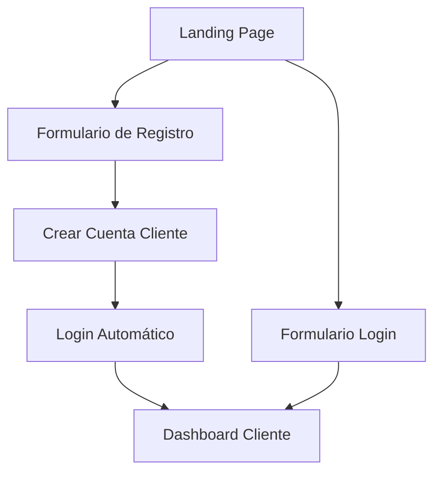
```mermaid
graph TD
    A[Landing Page] --> B[Formulario de Registro]
    B --> C[Crear Cuenta Cliente]
    C --> D[Login Automático]
    D --> E[Dashboard Cliente]
    
    A --> F[Formulario Login]
    F --> E
```

**Pasos detallados:**
1. Visita el landing page en `/`
2. Clic en "Registrarse" → `/registro`
3. Completa formulario con datos personales
4. El sistema crea usuario con rol `cliente`
5. Redirección automática a `/dashboard`

### 2. **Gestión de Mascotas**
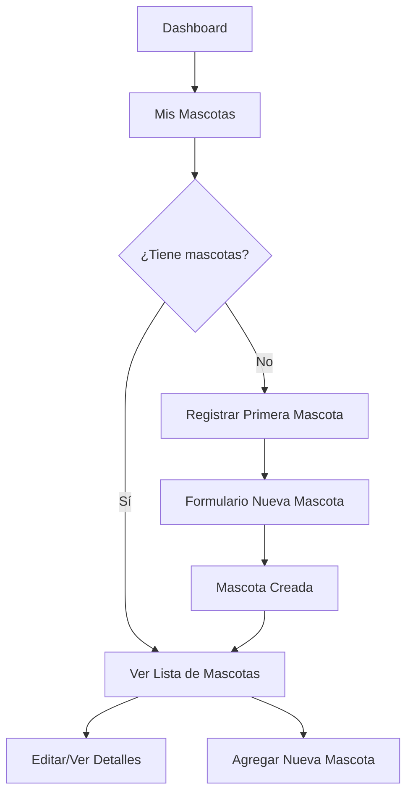
```mermaid
graph TD
    A[Dashboard] --> B[Mis Mascotas]
    B --> C{¿Tiene mascotas?}
    C -->|No| D[Registrar Primera Mascota]
    C -->|Sí| E[Ver Lista de Mascotas]
    D --> F[Formulario Nueva Mascota]
    F --> G[Mascota Creada]
    G --> E
    E --> H[Editar/Ver Detalles]
    E --> I[Agregar Nueva Mascota]
```

**Funcionalidades:**
- **Crear mascota**: Nombre, especie, raza, fecha nacimiento, foto opcional
- **Editar información**: Actualizar datos, peso, microchip
- **Eliminar mascota**: Con confirmación
- **Subir foto**: Compresión automática de imágenes

### 3. **Agendamiento de Citas**
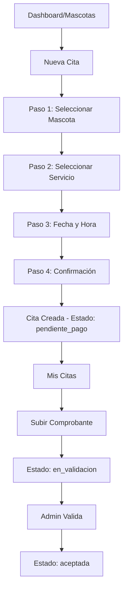
```mermaid
graph TD
    A[Dashboard/Mascotas] --> B[Nueva Cita]
    B --> C[Paso 1: Seleccionar Mascota]
    C --> D[Paso 2: Seleccionar Servicio]
    D --> E[Paso 3: Fecha y Hora]
    E --> F[Paso 4: Confirmación]
    F --> G[Cita Creada - Estado: pendiente_pago]
    G --> H[Mis Citas]
    H --> I[Subir Comprobante]
    I --> J[Estado: en_validacion]
    J --> K[Admin Valida]
    K --> L[Estado: aceptada]
```

**Servicios Disponibles:**
- Consulta General (S/. 80)
- Vacunación (S/. 65)
- Emergencia (S/. 150)
- Grooming (S/. 45)
- Cirugía (S/. 250)
- Diagnóstico (S/. 120)

### 4. **Gestión de Pagos**
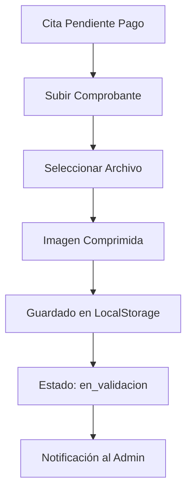
```mermaid
graph TD
    A[Cita Pendiente Pago] --> B[Subir Comprobante]
    B --> C[Seleccionar Archivo]
    C --> D[Imagen Comprimida]
    D --> E[Guardado en LocalStorage]
    E --> F[Estado: en_validacion]
    F --> G[Notificación al Admin]
```

**Métodos de Pago Aceptados:**
- YAPE
- PLIN
- Banca Móvil BCP
- Interbank
- Otros bancos

### 5. **Seguimiento de Citas**
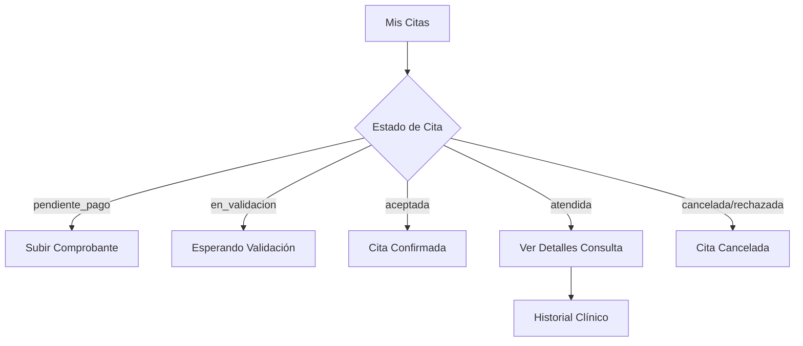
```mermaid
graph TD
    A[Mis Citas] --> B{Estado de Cita}
    B -->|pendiente_pago| C[Subir Comprobante]
    B -->|en_validacion| D[Esperando Validación]
    B -->|aceptada| E[Cita Confirmada]
    B -->|atendida| F[Ver Detalles Consulta]
    B -->|cancelada/rechazada| G[Cita Cancelada]
    
    F --> H[Historial Clínico]
```

### 6. **Historial Clínico**
- **Vista por mascota**: Todas las consultas de cada mascota
- **Detalles de consulta**: Diagnóstico, tratamiento, medicamentos
- **Archivos adjuntos**: Exámenes, radiografías
- **Próximas citas**: Recordatorios de vacunas/consultas

---

## 👨‍💼 Flujo del Admin

### 1. **Dashboard Principal**
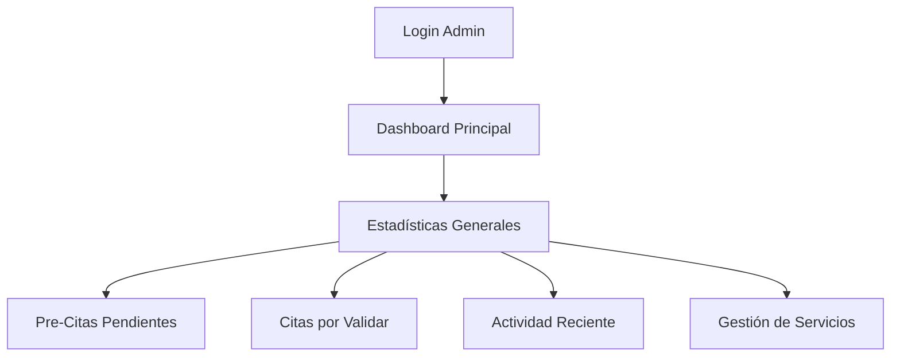
```mermaid
graph TD
    A[Login Admin] --> B[Dashboard Principal]
    B --> C[Estadísticas Generales]
    C --> D[Pre-Citas Pendientes]
    C --> E[Citas por Validar]
    C --> F[Actividad Reciente]
    C --> G[Gestión de Servicios]
```

**Estadísticas Principales:**
- Total de usuarios por rol
- Citas del día/semana/mes
- Ingresos y facturación
- Mascotas registradas
- Pre-citas pendientes

### 2. **Gestión de Pre-Citas**
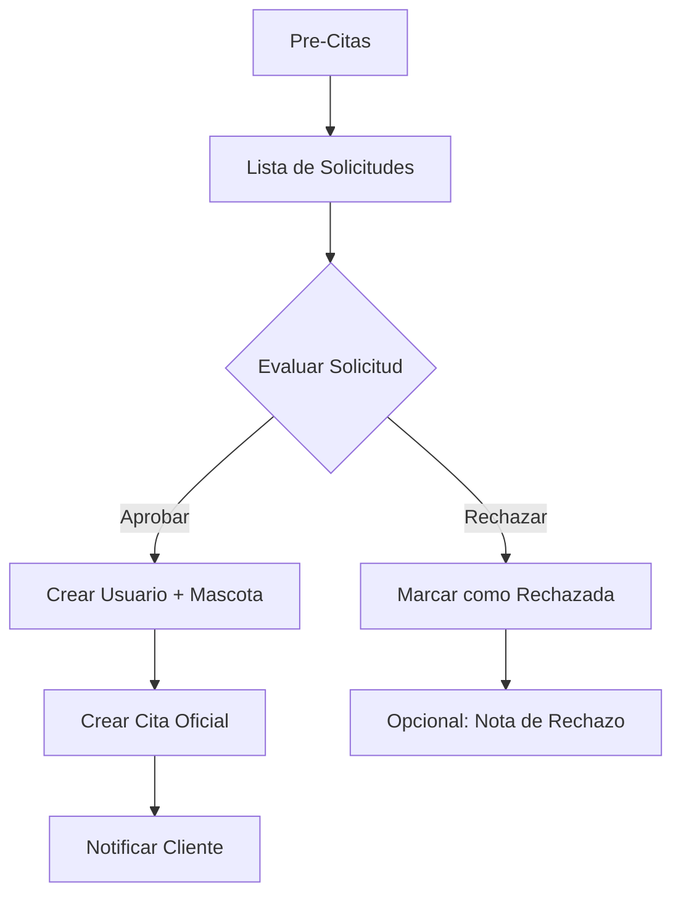
```mermaid
graph TD
    A[Pre-Citas] --> B[Lista de Solicitudes]
    B --> C{Evaluar Solicitud}
    C -->|Aprobar| D[Crear Usuario + Mascota]
    D --> E[Crear Cita Oficial]
    E --> F[Notificar Cliente]
    C -->|Rechazar| G[Marcar como Rechazada]
    G --> H[Opcional: Nota de Rechazo]
```

**Proceso Detallado:**
1. **Recibir solicitud** desde el landing page
2. **Evaluar información**: Verificar datos completos
3. **Aprobar**: 
   - Crear cuenta de cliente automáticamente
   - Crear registro de mascota
   - Generar cita oficial
   - Enviar credenciales por email
4. **Rechazar**: Marcar con motivo

### 3. **Validación de Pagos**
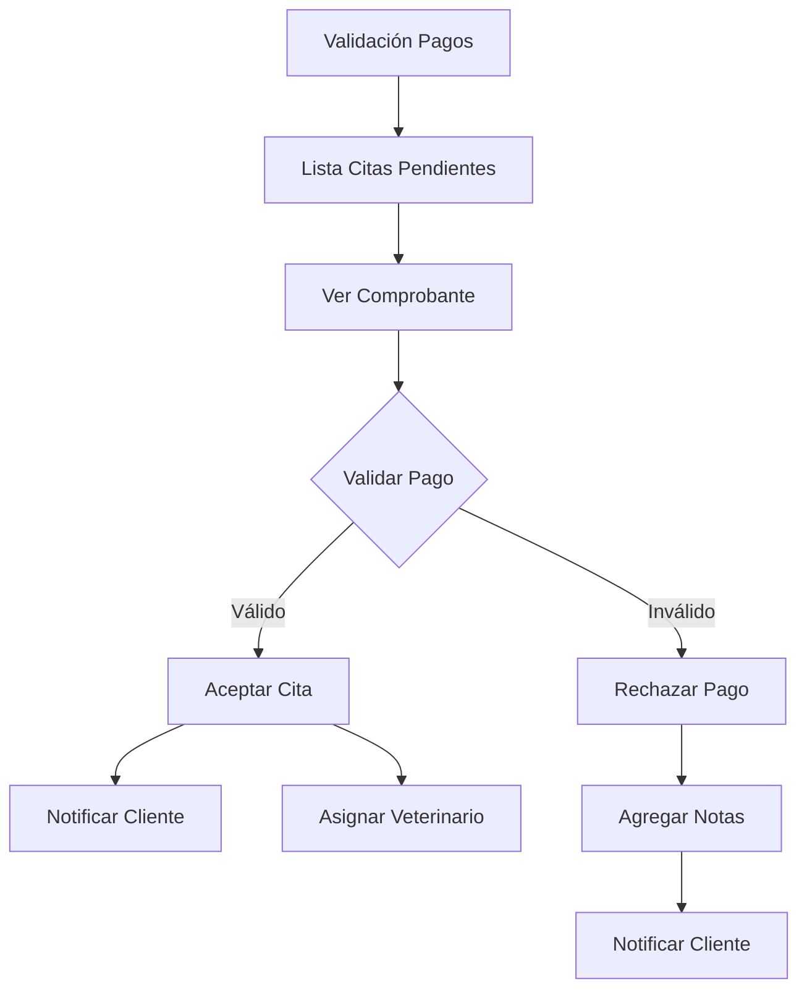
```mermaid
graph TD
    A[Validación Pagos] --> B[Lista Citas Pendientes]
    B --> C[Ver Comprobante]
    C --> D{Validar Pago}
    D -->|Válido| E[Aceptar Cita]
    E --> F[Notificar Cliente]
    E --> G[Asignar Veterinario]
    D -->|Inválido| H[Rechazar Pago]
    H --> I[Agregar Notas]
    I --> J[Notificar Cliente]
```

**Criterios de Validación:**
- Monto correcto
- Fecha de transferencia válida
- Datos bancarios correctos
- Comprobante legible

### 4. **Gestión de Usuarios**
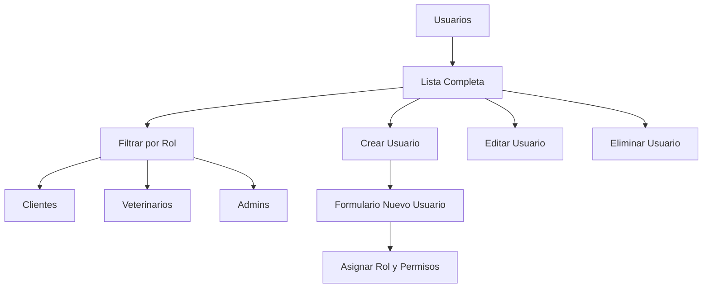
```mermaid
graph TD
    A[Usuarios] --> B[Lista Completa]
    B --> C[Filtrar por Rol]
    C --> D[Clientes]
    C --> E[Veterinarios]
    C --> F[Admins]
    
    B --> G[Crear Usuario]
    B --> H[Editar Usuario]
    B --> I[Eliminar Usuario]
    
    G --> J[Formulario Nuevo Usuario]
    J --> K[Asignar Rol y Permisos]
```

### 5. **Gestión de Servicios**
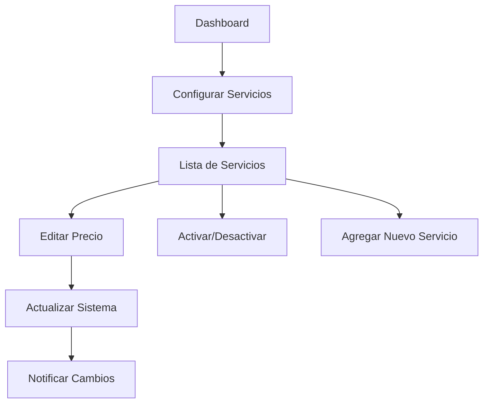
```mermaid
graph TD
    A[Dashboard] --> B[Configurar Servicios]
    B --> C[Lista de Servicios]
    C --> D[Editar Precio]
    C --> E[Activar/Desactivar]
    C --> F[Agregar Nuevo Servicio]
    
    D --> G[Actualizar Sistema]
    G --> H[Notificar Cambios]
```

### 6. **Gestión de Newsletter**
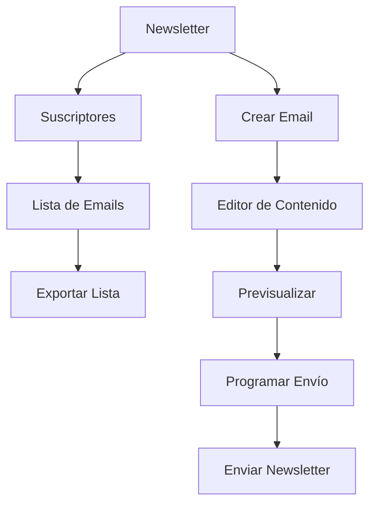
```mermaid
graph TD
    A[Newsletter] --> B[Suscriptores]
    B --> C[Lista de Emails]
    C --> D[Exportar Lista]
    
    A --> E[Crear Email]
    E --> F[Editor de Contenido]
    F --> G[Previsualizar]
    G --> H[Programar Envío]
    H --> I[Enviar Newsletter]
```

---

## 👨‍⚕️ Flujo del Veterinario

### 1. **Dashboard Veterinario**
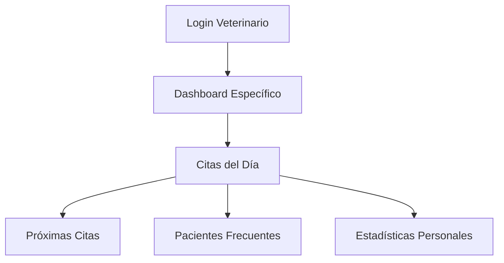
```mermaid
graph TD
    A[Login Veterinario] --> B[Dashboard Específico]
    B --> C[Citas del Día]
    C --> D[Próximas Citas]
    C --> E[Pacientes Frecuentes]
    C --> F[Estadísticas Personales]
```

### 2. **Agenda Médica**
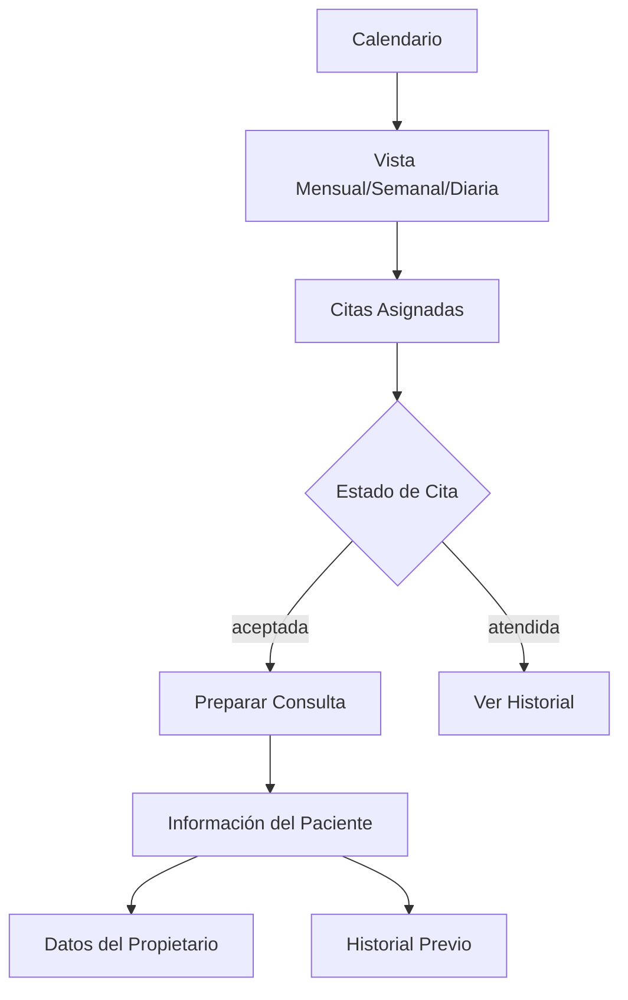
```mermaid
graph TD
    A[Calendario] --> B[Vista Mensual/Semanal/Diaria]
    B --> C[Citas Asignadas]
    C --> D{Estado de Cita}
    D -->|aceptada| E[Preparar Consulta]
    D -->|atendida| F[Ver Historial]
    
    E --> G[Información del Paciente]
    G --> H[Datos del Propietario]
    G --> I[Historial Previo]
```

### 3. **Gestión de Pacientes**
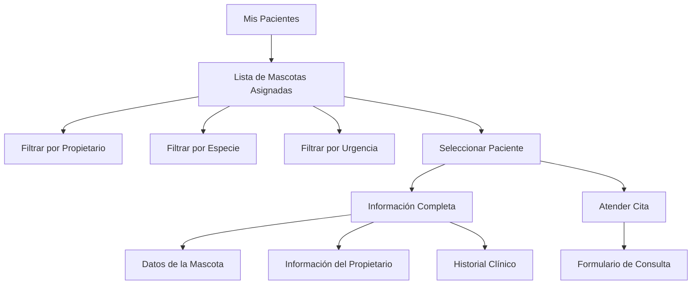
```mermaid
graph TD
    A[Mis Pacientes] --> B[Lista de Mascotas Asignadas]
    B --> C[Filtrar por Propietario]
    B --> D[Filtrar por Especie]
    B --> E[Filtrar por Urgencia]
    
    B --> F[Seleccionar Paciente]
    F --> G[Información Completa]
    G --> H[Datos de la Mascota]
    G --> I[Información del Propietario]
    G --> J[Historial Clínico]
    
    F --> K[Atender Cita]
    K --> L[Formulario de Consulta]
```

### 4. **Atención de Consultas**
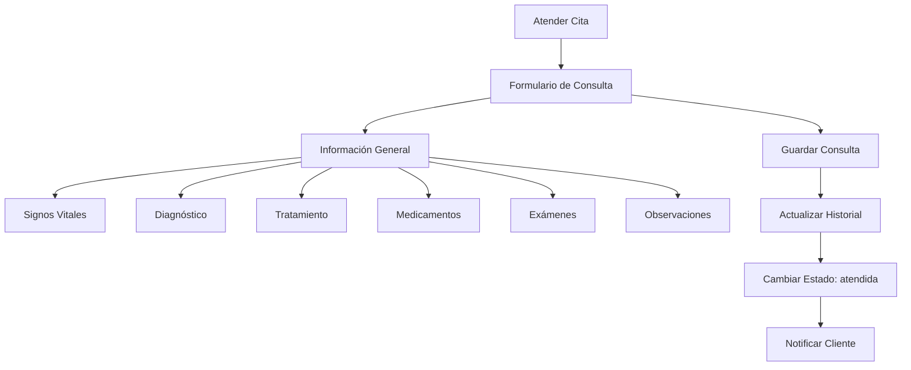
```mermaid
graph TD
    A[Atender Cita] --> B[Formulario de Consulta]
    B --> C[Información General]
    C --> D[Signos Vitales]
    C --> E[Diagnóstico]
    C --> F[Tratamiento]
    C --> G[Medicamentos]
    C --> H[Exámenes]
    C --> I[Observaciones]
    
    B --> J[Guardar Consulta]
    J --> K[Actualizar Historial]
    K --> L[Cambiar Estado: atendida]
    L --> M[Notificar Cliente]
```

**Datos de Consulta:**
- **Signos vitales**: Peso, temperatura, presión arterial, frecuencia cardíaca
- **Diagnóstico**: Descripción detallada
- **Tratamiento**: Plan de tratamiento
- **Medicamentos**: Nombre, dosis, frecuencia, duración
- **Exámenes**: Tipo y resultados
- **Próxima visita**: Fecha sugerida

### 5. **Historial Clínico Completo**
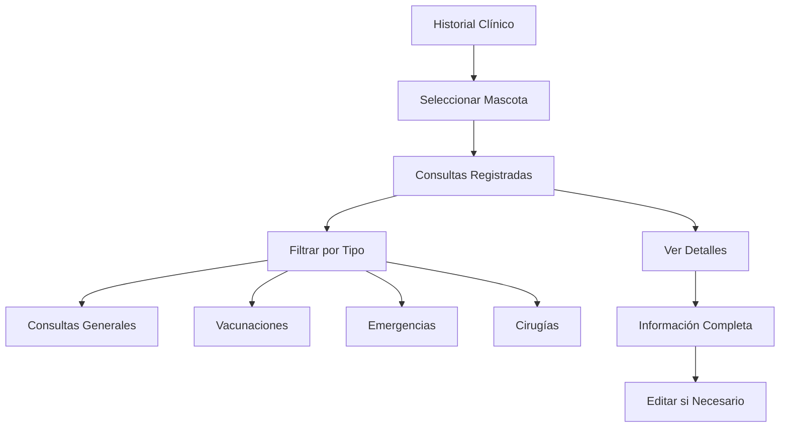
```mermaid
graph TD
    A[Historial Clínico] --> B[Seleccionar Mascota]
    B --> C[Consultas Registradas]
    C --> D[Filtrar por Tipo]
    D --> E[Consultas Generales]
    D --> F[Vacunaciones]
    D --> G[Emergencias]
    D --> H[Cirugías]
    
    C --> I[Ver Detalles]
    I --> J[Información Completa]
    J --> K[Editar si Necesario]
```

---

## 🔄 Estados y Transiciones

### Estados de Citas
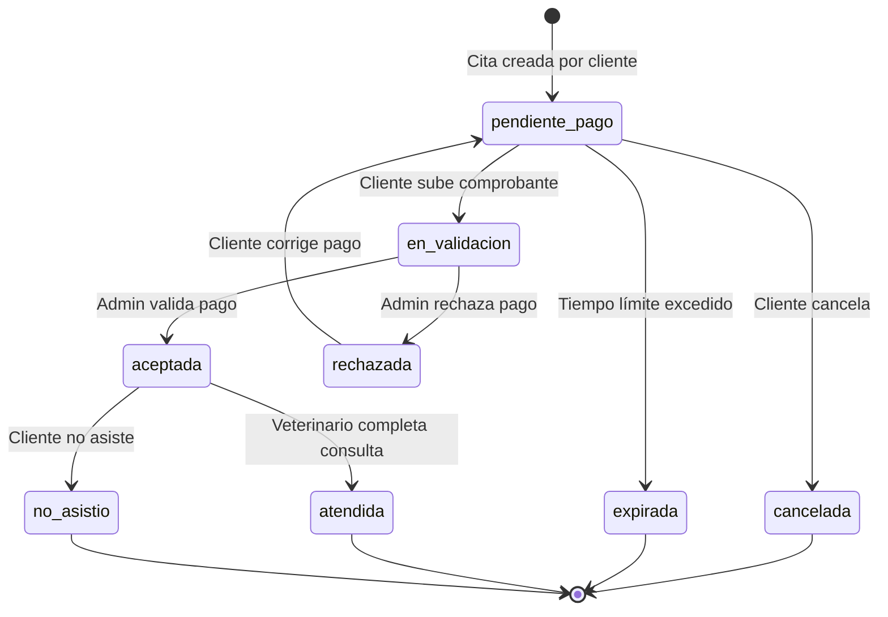
```mermaid
stateDiagram-v2
    [*] --> pendiente_pago : Cita creada por cliente
    pendiente_pago --> en_validacion : Cliente sube comprobante
    en_validacion --> aceptada : Admin valida pago
    en_validacion --> rechazada : Admin rechaza pago
    aceptada --> atendida : Veterinario completa consulta
    aceptada --> no_asistio : Cliente no asiste
    pendiente_pago --> cancelada : Cliente cancela
    pendiente_pago --> expirada : Tiempo límite excedido
    
    rechazada --> pendiente_pago : Cliente corrige pago
    cancelada --> [*]
    expirada --> [*]
    atendida --> [*]
    no_asistio --> [*]
```

### Estados de Pre-Citas
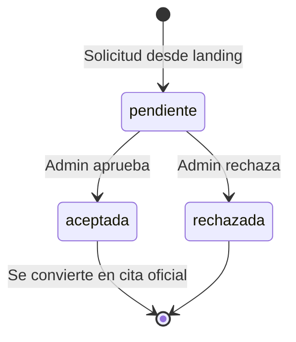
```mermaid
stateDiagram-v2
    [*] --> pendiente : Solicitud desde landing
    pendiente --> aceptada : Admin aprueba
    pendiente --> rechazada : Admin rechaza
    aceptada --> [*] : Se convierte en cita oficial
    rechazada --> [*]
```

### Estados de Usuarios
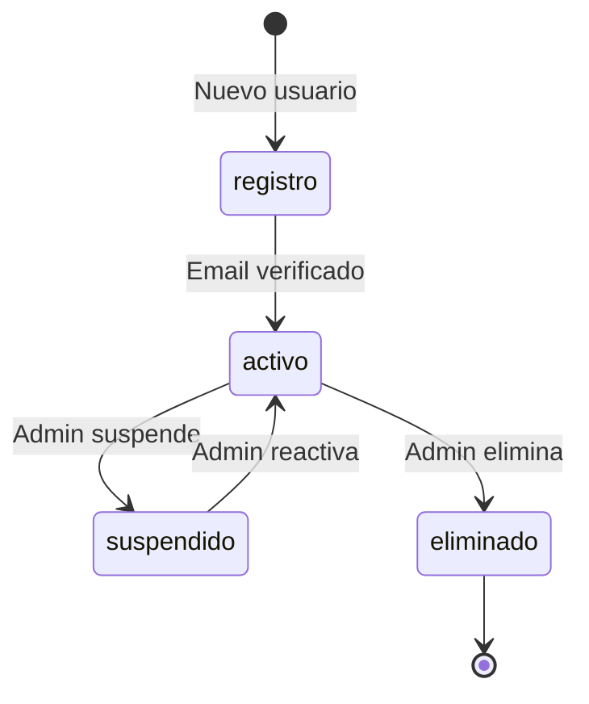
```mermaid
stateDiagram-v2
    [*] --> registro : Nuevo usuario
    registro --> activo : Email verificado
    activo --> suspendido : Admin suspende
    suspendido --> activo : Admin reactiva
    activo --> eliminado : Admin elimina
    eliminado --> [*]
```

---

## 💾 Gestión de Datos

### Almacenamiento Local
```javascript
// Estructura de datos en localStorage
{
  user: Usuario,                    // Usuario logueado
  usuarios: Usuario[],              // Todos los usuarios
  mascotas: Mascota[],             // Todas las mascotas
  citas: Cita[],                   // Todas las citas
  preCitas: PreCita[],             // Pre-citas del landing
  historialClinico: HistorialClinico[], // Consultas médicas
  notificaciones: Notificacion[],   // Sistema de notificaciones
  comprobante_[citaId]: ComprobanteData, // Archivos de pago
  veterinary_services: Servicio[]   // Configuración de servicios
}
```

### Relaciones de Datos
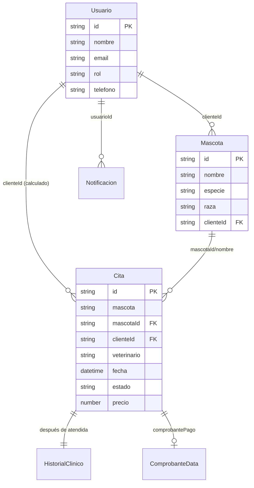
```mermaid
erDiagram
    Usuario ||--o{ Mascota : "clienteId"
    Usuario ||--o{ Cita : "clienteId (calculado)"
    Mascota ||--o{ Cita : "mascotaId/nombre"
    Cita ||--|| HistorialClinico : "después de atendida"
    Usuario ||--o{ Notificacion : "usuarioId"
    Cita ||--o| ComprobanteData : "comprobantePago"
    
    Usuario {
        string id PK
        string nombre
        string email
        string rol
        string telefono
    }
    
    Mascota {
        string id PK
        string nombre
        string especie
        string raza
        string clienteId FK
    }
    
    Cita {
        string id PK
        string mascota
        string mascotaId FK
        string clienteId FK
        string veterinario
        datetime fecha
        string estado
        number precio
    }
```

### Sistema de Reparación Automática
El sistema incluye funciones de auto-reparación para mantener la integridad de datos:

1. **Auto-detección de problemas**: Mascotas sin propietario, citas desvinculadas
2. **Reparación automática**: Vinculación inteligente basada en patrones
3. **Alertas visuales**: Indicadores para problemas que requieren atención manual
4. **Funciones manuales**: Herramientas para admin/veterinario para corregir datos

---

## 🔒 Seguridad y Validaciones

### Autenticación y Autorización
```mermaid
graph TD
    A[Intento de Acceso] --> B{¿Usuario Autenticado?}
    B -->|No| C[Redirect a Login]
    B -->|Sí| D{¿Rol Permitido?}
    D -->|No| E[Acceso Denegado]
    D -->|Sí| F[Permitir Acceso]
    
    C --> G[Login Exitoso]
    G --> D
```

### Validaciones por Rol
- **Rutas protegidas**: `ProtectedRoute` component
- **Validación de permisos**: Por rol en cada página
- **Datos sensibles**: Solo accesibles por rol apropiado

### Validaciones de Datos
- **Formularios**: Validación en tiempo real
- **Subida de archivos**: Compresión y validación de tipo
- **Integridad de relaciones**: Verificación automática
- **Límites de almacenamiento**: Optimización automática de localStorage

---

## 🔔 Sistema de Notificaciones

### Tipos de Notificaciones
1. **bienvenida_cliente**: Nuevo usuario registrado
2. **cita_aceptada**: Cita confirmada por admin
3. **consulta_registrada**: Historial médico actualizado
4. **sistema**: Notificaciones administrativas

### Flujo de Notificaciones
```mermaid
graph TD
    A[Evento del Sistema] --> B[Crear Notificación]
    B --> C[Guardar en Base de Datos]
    C --> D[Mostrar Toast Automático]
    D --> E[Marcar en Campana de Notificaciones]
    E --> F[Usuario Ve Notificación]
    F --> G[Marcar como Leída]
```

---

## 📱 Responsive Design

El sistema está completamente optimizado para:
- **Desktop**: Navegación completa con sidebar
- **Tablet**: Navegación adaptada con menú desplegable
- **Mobile**: Menú hamburguesa y diseño touch-friendly

---

## 🚀 Funcionalidades Avanzadas

### 1. **Dashboard Inteligente**
- Estadísticas en tiempo real
- Gráficos interactivos
- Filtros dinámicos
- Exportación de datos

### 2. **Gestión de Archivos**
- Compresión automática de imágenes
- Optimización de almacenamiento
- Previsualización de comprobantes
- Respaldo automático

### 3. **Sistema de Búsqueda**
- Búsqueda tolerante (case-insensitive)
- Filtros múltiples
- Búsqueda en tiempo real
- Resultados organizados

### 4. **Herramientas de Admin**
- Configuración de servicios en tiempo real
- Gestión masiva de usuarios
- Reportes y analytics
- Sistema de backup

---

Este documento proporciona una visión completa del sistema PetLA, desde la perspectiva de cada tipo de usuario hasta los detalles técnicos de implementación. El sistema está diseñado para ser intuitivo, robusto y escalable, con énfasis en la experiencia del usuario y la integridad de los datos.
