# 🩺 Documentación de Flujos del Sistema Veterinario PetLA

## 🌟 Resumen Ejecutivo del Sistema

**PetLA** es una plataforma web integral diseñada para revolucionar la gestión de clínicas veterinarias, conectando de manera eficiente a propietarios de mascotas, veterinarios y administradores en un ecosistema digital completo.

### 🎯 ¿Qué es PetLA?

PetLA es un sistema de gestión veterinaria que digitaliza y optimiza todos los procesos de una clínica moderna, desde el agendamiento inicial hasta el seguimiento post-consulta. La plataforma facilita la comunicación entre todas las partes involucradas y garantiza un servicio de calidad para las mascotas.

### 🚀 Propósito Principal

Transformar la experiencia veterinaria tradicional en un proceso digital fluido que:
- **Simplifica** el agendamiento de citas para los dueños de mascotas
- **Optimiza** la gestión de pacientes para los veterinarios
- **Automatiza** los procesos administrativos para el personal
- **Centraliza** toda la información médica en un historial digital completo

### 👥 Usuarios del Sistema

**🟦 Clientes (Propietarios de Mascotas)**
- Registran y gestionan la información de sus mascotas
- Agendan citas médicas de forma autónoma
- Suben comprobantes de pago digital
- Consultan el historial médico de sus mascotas
- Reciben notificaciones sobre el estado de sus citas

**🟩 Veterinarios**
- Acceden a su agenda médica personalizada
- Gestionan información completa de pacientes y propietarios
- Registran consultas y actualizan historiales clínicos
- Utilizan herramientas de búsqueda avanzada de pacientes
- Monitorean estadísticas de su práctica profesional

**🟥 Administradores**
- Supervisan todas las operaciones de la clínica
- Validan comprobantes de pago y gestionan facturación
- Administran usuarios y asignan veterinarios
- Procesan pre-citas del sitio web público
- Configuran servicios, precios y parámetros del sistema

### 🔧 Características Principales

**📅 Gestión Inteligente de Citas**
- Sistema de estados automatizado (pendiente → validación → confirmada → atendida)
- Asignación automática de veterinarios
- Validación digital de comprobantes de pago
- Notificaciones en tiempo real

**🏥 Historial Clínico Digital**
- Registro completo de consultas médicas
- Seguimiento de tratamientos y medicamentos
- Análisis de tendencias de salud
- Acceso controlado por roles

**💳 Sistema de Pagos Integrado**
- Múltiples métodos de pago (YAPE, PLIN, bancos)
- Validación automática de comprobantes
- Gestión de facturación
- Seguimiento de pagos pendientes

**🔍 Búsqueda y Filtrado Avanzado**
- Búsqueda inteligente de pacientes
- Filtros por múltiples criterios
- Resultados en tiempo real
- Información contextual enriquecida

**📊 Dashboard y Estadísticas**
- Métricas en tiempo real por rol
- Indicadores de rendimiento
- Análisis de tendencias
- Reportes automatizados

### 🏗️ Arquitectura Técnica

**Frontend**
- React 18 con TypeScript para máxima confiabilidad
- TailwindCSS + Radix UI para interfaz moderna y accesible
- React Router 6 para navegación fluida (SPA)
- Context API + localStorage para gestión de estado

**Características Técnicas**
- Diseño responsive (desktop, tablet, móvil)
- Compresión automática de imágenes
- Sistema de notificaciones inteligentes
- Validación en tiempo real
- Auto-reparación de datos inconsistentes

### 🌊 Flujo General del Sistema

```mermaid
graph TD
    A[Usuario Accede al Sistema] --> B{Tipo de Usuario}

    B -->|Cliente| C[Dashboard Cliente]
    C --> D[Gestionar Mascotas]
    C --> E[Agendar Citas]
    C --> F[Ver Historial]

    B -->|Veterinario| G[Dashboard Veterinario]
    G --> H[Agenda Médica]
    G --> I[Mis Pacientes]
    G --> J[Registrar Consultas]

    B -->|Admin| K[Dashboard Admin]
    K --> L[Validar Pagos]
    K --> M[Gestionar Usuarios]
    K --> N[Configurar Sistema]

    E --> O[Subir Comprobante]
    O --> P[Validación Admin]
    P --> Q[Asignación Veterinario]
    Q --> R[Atención Médica]
    R --> S[Actualizar Historial]
```



---

## 💻 Resumen Completo de Desarrollo

### 🏗️ **Stack Tecnológico Completo**

**Frontend Framework**
- **React 18.2+** con TypeScript para desarrollo type-safe
- **Vite** como build tool y dev server para desarrollo rápido
- **React Router 6** para navegación SPA (Single Page Application)
- **Context API** + localStorage para gestión de estado global

**UI/UX Framework**
- **TailwindCSS 3.4+** para sistema de diseño utility-first
- **Radix UI** como biblioteca de componentes primitivos accesibles
- **Lucide React** para iconografía consistente y moderna
- **CVA (Class Variance Authority)** para variantes de componentes

**Herramientas de Desarrollo**
- **TypeScript 5.0+** para tipado estático y mejor DX
- **ESLint + Prettier** para linting y formateo de código
- **PostCSS** para procesamiento de CSS
- **Git** para control de versiones

### 🏛️ **Arquitectura de Desarrollo**

**Estructura del Proyecto**
```
src/
├── components/          # Componentes reutilizables
│   ├── ui/             # Componentes base de Radix UI
│   ├── Layout.tsx      # Layout principal con navegación
│   ├── modals/         # Modales especializados
│   └── shared/         # Componentes compartidos
├── contexts/           # Context providers
│   └── AppContext.tsx  # Estado global de la aplicación
├── hooks/              # Custom React hooks
├── lib/                # Utilidades y helpers
│   ├── utils.ts        # Funciones utilitarias
│   ├── citaUtils.ts    # Lógica específica de citas
│   └── types.ts        # Definiciones de TypeScript
├── pages/              # Componentes de páginas
│   ├── Dashboard.tsx
│   ├── Calendario.tsx
│   ├── GestionCitas.tsx
│   └── ...
└── main.tsx           # Punto de entrada de la aplicación
```

**Patrón de Componentes**
- **Atomic Design**: Componentes organizados desde básicos hasta complejos
- **Composition over Inheritance**: Uso de props y children para flexibilidad
- **Custom Hooks**: Lógica reutilizable extraída en hooks personalizados
- **Type Safety**: Interfaces TypeScript para todas las props y datos

### 🎨 **Sistema de Diseño y UI**

**Design System Personalizado**
```css
/* Paleta de colores personalizada */
:root {
  --vet-primary: #2B7F75;      /* Verde veterinario principal */
  --vet-secondary: #F97316;     /* Naranja complementario */
  --vet-gray-50: #F9FAFB;      /* Backgrounds */
  --vet-gray-900: #111827;     /* Textos principales */
}
```

**Componentes UI Construidos**
- **Buttons**: Variantes (default, outline, ghost) con estados
- **Cards**: Containers consistentes con shadows y borders
- **Modals/Dialogs**: Overlays accesibles con Radix UI
- **Forms**: Inputs, selects, textareas con validación
- **Tables**: Tablas responsivas con sorting y filtros
- **Badges**: Indicadores de estado con colores semánticos
- **Alerts**: Notificaciones con diferentes niveles de severidad

**Responsive Design**
- **Mobile-first**: Diseño que inicia en móvil y escala hacia desktop
- **Breakpoints**: sm: 640px, md: 768px, lg: 1024px, xl: 1280px
- **Grid System**: CSS Grid y Flexbox para layouts complejos
- **Touch-friendly**: Botones y controles optimizados para touch

### 🔧 **Gestión de Estado y Datos**

**Context API Implementation**
```typescript
interface AppContextType {
  // Estado de usuario
  user: Usuario | null;
  usuarios: Usuario[];

  // Datos principales
  citas: Cita[];
  mascotas: Mascota[];
  historialClinico: HistorialClinico[];

  // Funciones de mutación
  updateCita: (id: string, updates: Partial<Cita>) => void;
  deleteCita: (id: string) => void;
  addNotification: (notification: Notificacion) => void;
}
```

**localStorage como Persistencia**
- **Datos estructurados**: JSON serialization para objetos complejos
- **Auto-sync**: Sincronización automática entre context y localStorage
- **Fallback handling**: Manejo de errores y datos corruptos
- **Compresión de imágenes**: Algoritmos de optimización para archivos

**Data Flow Pattern**
1. **UI Action** → Trigger desde componente
2. **Context Update** → Actualización del estado global
3. **localStorage Sync** → Persistencia automática
4. **Re-render** → Actualización reactiva de UI

### 🛡️ **Validación y Type Safety**

**TypeScript Interfaces**
```typescript
interface Cita {
  id: string;
  mascota: string;
  mascotaId?: string;
  clienteId?: string;
  clienteNombre?: string;
  veterinario: string;
  fecha: Date;
  estado: EstadoCita;
  precio: number;
  tipoConsulta: string;
  motivo: string;
  ubicacion: string;
  notas?: string;
  notasAdmin?: string;
  comprobantePago?: string;
}

type EstadoCita =
  | 'pendiente_pago'
  | 'en_validacion'
  | 'aceptada'
  | 'atendida'
  | 'cancelada'
  | 'rechazada'
  | 'no_asistio';
```

**Validación en Runtime**
- **Form validation**: Validación en tiempo real en formularios
- **Data integrity**: Verificación de relaciones entre entidades
- **Error boundaries**: Manejo de errores a nivel de componente
- **Auto-repair functions**: Funciones de reparación automática de datos

### 🚀 **Funcionalidades Avanzadas Implementadas**

**Sistema de Notificaciones**
- **Toast notifications**: Notificaciones temporales no-intrusivas
- **Real-time updates**: Actualizaciones en tiempo real del estado
- **Notification center**: Centro de notificaciones persistentes
- **Smart routing**: Navegación contextual basada en notificaciones

**Búsqueda y Filtrado Inteligente**
- **Fuzzy search**: Búsqueda tolerante a errores tipográficos
- **Multi-criteria filtering**: Filtros combinados por múltiples campos
- **Real-time results**: Resultados de búsqueda en tiempo real
- **Search highlighting**: Resaltado de términos de búsqueda

**Gestión de Archivos**
- **Image compression**: Compresión automática de imágenes
- **File validation**: Validación de tipos y tamaños de archivo
- **Preview generation**: Generación de previsualizaciones
- **Base64 encoding**: Codificación para almacenamiento local

**Auto-repair System**
- **Relationship detection**: Detección automática de relaciones rotas
- **Data migration**: Migración automática de formatos antiguos
- **Consistency checks**: Verificaciones de consistencia de datos
- **Smart suggestions**: Sugerencias inteligentes para correcciones

### 🔐 **Seguridad y Autenticación**

**Role-based Access Control**
- **Protected Routes**: Rutas protegidas por rol de usuario
- **Component-level Guards**: Validación de permisos a nivel de componente
- **Dynamic Navigation**: Navegación que se adapta según el rol
- **Session Management**: Gestión de sesiones con localStorage

**Data Protection**
- **Input sanitization**: Sanitización de inputs de usuario
- **XSS prevention**: Prevención de ataques Cross-Site Scripting
- **Data validation**: Validación estricta de datos en frontend
- **Secure file handling**: Manejo seguro de archivos subidos

### 📱 **Optimización y Performance**

**Code Splitting**
- **Lazy loading**: Carga perezosa de rutas y componentes
- **Bundle optimization**: Optimización de bundles de JavaScript
- **Tree shaking**: Eliminación de código no utilizado
- **Dynamic imports**: Importaciones dinámicas para mejor performance

**UI Performance**
- **Virtual scrolling**: Para listas largas de datos
- **Debounced search**: Búsqueda con debounce para mejor UX
- **Memoization**: React.memo y useMemo para evitar re-renders
- **Optimistic updates**: Actualizaciones optimistas de UI

**Asset Optimization**
- **Image compression**: Compresión automática de imágenes
- **Icon optimization**: Uso de SVG icons para mejor rendimiento
- **CSS optimization**: Purging de CSS no utilizado
- **Minification**: Minificación de todos los assets

### 🌐 **Deployment y Build**

**Build Process**
- **Vite build**: Build optimizado con Vite
- **TypeScript compilation**: Compilación con verificación de tipos
- **Asset bundling**: Bundling inteligente de assets
- **Environment configs**: Configuraciones por ambiente

**Deployment Strategy**
- **Cloud deployment**: Despliegue en plataforma cloud
- **CI/CD pipeline**: Pipeline de integración y despliegue continuo
- **Environment variables**: Gestión segura de variables de entorno
- **Monitoring**: Monitoreo de performance y errores

### 🎨 Experiencia de Usuario

**Simplicidad**: Interfaz intuitiva que reduce la curva de aprendizaje
**Eficiencia**: Procesos optimizados que ahorran tiempo a todos los usuarios
**Transparencia**: Seguimiento en tiempo real del estado de las citas
**Accesibilidad**: Diseño responsive y accesible desde cualquier dispositivo
**Confiabilidad**: Sistema robusto con validaciones y auto-reparación de datos

---

## 📋 Tabla de Contenidos

1. [Resumen Ejecutivo](#resumen-ejecutivo-del-sistema)
2. [Arquitectura del Sistema](#arquitectura-del-sistema)
3. [Roles y Permisos](#roles-y-permisos)
4. [Flujo del Cliente](#flujo-del-cliente)
5. [Flujo del Admin](#flujo-del-admin)
6. [Flujo del Veterinario](#flujo-del-veterinario)
7. [Gestión de Citas](#flujo-de-gestión-de-citas-admin)
8. [Estados y Transiciones](#estados-y-transiciones)
9. [Gestión de Datos](#gestión-de-datos)
10. [Seguridad y Validaciones](#seguridad-y-validaciones)

---

---

## 🏗️ Arquitectura del Sistema

### Tecnologías
- **Frontend**: React 18 + TypeScript + TailwindCSS
- **Router**: React Router 6 (SPA)
- **Estado**: Context API con localStorage
- **UI Components**: Radix UI + Lucide Icons
- **Styling**: TailwindCSS + CVA (Class Variance Authority)

### Estructura de Rutas
```
/                           # Landing page público
/login, /registro           # Autenticación
/dashboard                  # Dashboard específico por rol

# Rutas de Cliente
/mascotas                   # Gestión de mascotas
/mis-citas                  # Gestión de citas
/nueva-cita                 # Agendar nueva cita
/historial                  # Historial clínico de mascotas

# Rutas de Veterinario
/calendario                 # Agenda médica
/mis-pacientes              # Lista de pacientes asignados
/historial-clinico-veterinario  # Historial clínico completo

# Rutas de Admin
/pre-citas                  # Gestionar solicitudes públicas
/gestion-citas              # Gestionar todas las citas
/validacion-pagos           # Validar comprobantes de pago
/usuarios                   # Gestión de usuarios
/veterinarios               # Gestión de veterinarios
/gestion-newsletter         # Gestión de newsletter

# Rutas Comunes
/configuracion              # Configuración de cuenta
/notificaciones             # Centro de notificaciones
```

---

## 👥 Roles y Permisos

### 🟦 Cliente
- Gestiona sus mascotas
- Agenda citas médicas
- Sube comprobantes de pago
- Ve el historial clínico de sus mascotas
- Recibe notificaciones

### 🟩 Veterinario
- Ve su agenda médica
- Gestiona sus pacientes asignados
- Completa consultas médicas
- Actualiza historiales clínicos
- Ve información completa de mascotas y propietarios

### 🟥 Admin
- Gestiona todos los usuarios
- Valida comprobantes de pago
- Gestiona pre-citas del landing
- Configura servicios y precios
- Envía newsletters
- Acceso completo al sistema

---

## 👤 Flujo del Cliente

### 1. **Registro e Inicio de Sesión**

```mermaid
graph TD
    A[Landing Page] --> B[Formulario de Registro]
    B --> C[Crear Cuenta Cliente]
    C --> D[Login Automático]
    D --> E[Dashboard Cliente]
    
    A --> F[Formulario Login]
    F --> E
```


**Pasos detallados:**
1. Visita el landing page en `/`
2. Clic en "Registrarse" → `/registro`
3. Completa formulario con datos personales
4. El sistema crea usuario con rol `cliente`
5. Redirección automática a `/dashboard`

### 2. **Gestión de Mascotas**

```mermaid
graph TD
    A[Dashboard] --> B[Mis Mascotas]
    B --> C{¿Tiene mascotas?}
    C -->|No| D[Registrar Primera Mascota]
    C -->|Sí| E[Ver Lista de Mascotas]
    D --> F[Formulario Nueva Mascota]
    F --> G[Mascota Creada]
    G --> E
    E --> H[Editar/Ver Detalles]
    E --> I[Agregar Nueva Mascota]
```


**Funcionalidades:**
- **Crear mascota**: Nombre, especie, raza, fecha nacimiento, foto opcional
- **Editar información**: Actualizar datos, peso, microchip
- **Eliminar mascota**: Con confirmación
- **Subir foto**: Compresión automática de imágenes

### 3. **Agendamiento de Citas**


**Servicios Disponibles:**
- Consulta General (S/. 80)
- Vacunación (S/. 65)
- Emergencia (S/. 150)
- Grooming (S/. 45)
- Cirugía (S/. 250)
- Diagnóstico (S/. 120)

### 4. **Gestión de Pagos**

```mermaid
graph TD
    A[Cita Pendiente Pago] --> B[Subir Comprobante]
    B --> C[Seleccionar Archivo]
    C --> D[Imagen Comprimida]
    D --> E[Guardado en LocalStorage]
    E --> F[Estado: en_validacion]
    F --> G[Notificación al Admin]
```


**Métodos de Pago Aceptados:**
- YAPE
- PLIN
- Banca Móvil BCP
- Interbank
- Otros bancos

### 5. **Seguimiento de Citas**

```mermaid
graph TD
    A[Mis Citas] --> B{Estado de Cita}
    B -->|pendiente_pago| C[Subir Comprobante]
    B -->|en_validacion| D[Esperando Validación]
    B -->|aceptada| E[Cita Confirmada]
    B -->|atendida| F[Ver Detalles Consulta]
    B -->|cancelada/rechazada| G[Cita Cancelada]
    
    F --> H[Historial Clínico]
```


### 6. **Historial Clínico**
- **Vista por mascota**: Todas las consultas de cada mascota
- **Detalles de consulta**: Diagnóstico, tratamiento, medicamentos
- **Archivos adjuntos**: Exámenes, radiografías
- **Próximas citas**: Recordatorios de vacunas/consultas

---

## 👨‍💼 Flujo del Admin

### 1. **Dashboard Principal**

```mermaid
graph TD
    A[Login Admin] --> B[Dashboard Principal]
    B --> C[Estadísticas Generales]
    C --> D[Pre-Citas Pendientes]
    C --> E[Citas por Validar]
    C --> F[Actividad Reciente]
    C --> G[Gestión de Servicios]
```


**Estadísticas Principales:**
- Total de usuarios por rol
- Citas del día/semana/mes
- Ingresos y facturación
- Mascotas registradas
- Pre-citas pendientes

### 2. **Gestión de Pre-Citas**


**Proceso Detallado:**
1. **Recibir solicitud** desde el landing page
2. **Evaluar información**: Verificar datos completos
3. **Aprobar**: 
   - Crear cuenta de cliente automáticamente
   - Crear registro de mascota
   - Generar cita oficial
   - Enviar credenciales por email
4. **Rechazar**: Marcar con motivo

### 3. **Validación de Pagos**


**Criterios de Validación:**
- Monto correcto
- Fecha de transferencia válida
- Datos bancarios correctos
- Comprobante legible

### 4. **Gestión de Usuarios**


### 5. **Gestión de Servicios**


### 6. **Gestión de Newsletter**

```mermaid
graph TD
    A[Newsletter] --> B[Suscriptores]
    B --> C[Lista de Emails]
    C --> D[Exportar Lista]
    
    A --> E[Crear Email]
    E --> F[Editor de Contenido]
    F --> G[Previsualizar]
    G --> H[Programar Envío]
    H --> I[Enviar Newsletter]
```


---

## 👨‍⚕️ Flujo del Veterinario

### 1. **Dashboard Veterinario**


### 2. **Agenda Médica**


### 3. **Gestión de Pacientes**

```mermaid
graph TD
    A[Mis Pacientes] --> B[Lista de Mascotas Asignadas]
    B --> C[Filtrar por Propietario]
    B --> D[Filtrar por Especie]
    B --> E[Filtrar por Urgencia]
    
    B --> F[Seleccionar Paciente]
    F --> G[Información Completa]
    G --> H[Datos de la Mascota]
    G --> I[Información del Propietario]
    G --> J[Historial Clínico]
    
    F --> K[Atender Cita]
    K --> L[Formulario de Consulta]
```


### 4. **Atención de Consultas**


**Datos de Consulta:**
- **Signos vitales**: Peso, temperatura, presión arterial, frecuencia cardíaca
- **Diagnóstico**: Descripción detallada
- **Tratamiento**: Plan de tratamiento
- **Medicamentos**: Nombre, dosis, frecuencia, duración
- **Exámenes**: Tipo y resultados
- **Próxima visita**: Fecha sugerida

### 5. **Historial Clínico Completo**


---

## 🔄 Estados y Transiciones

### Estados de Citas

```mermaid
stateDiagram-v2
    [*] --> pendiente_pago : Cita creada por cliente
    pendiente_pago --> en_validacion : Cliente sube comprobante
    en_validacion --> aceptada : Admin valida pago
    en_validacion --> rechazada : Admin rechaza pago
    aceptada --> atendida : Veterinario completa consulta
    aceptada --> no_asistio : Cliente no asiste
    pendiente_pago --> cancelada : Cliente cancela
    pendiente_pago --> expirada : Tiempo límite excedido
    
    rechazada --> pendiente_pago : Cliente corrige pago
    cancelada --> [*]
    expirada --> [*]
    atendida --> [*]
    no_asistio --> [*]
```


### Estados de Pre-Citas


### Estados de Usuarios


---

## 💾 Gestión de Datos

### Almacenamiento Local
```javascript
// Estructura de datos en localStorage
{
  user: Usuario,                    // Usuario logueado
  usuarios: Usuario[],              // Todos los usuarios
  mascotas: Mascota[],             // Todas las mascotas
  citas: Cita[],                   // Todas las citas
  preCitas: PreCita[],             // Pre-citas del landing
  historialClinico: HistorialClinico[], // Consultas médicas
  notificaciones: Notificacion[],   // Sistema de notificaciones
  comprobante_[citaId]: ComprobanteData, // Archivos de pago
  veterinary_services: Servicio[]   // Configuración de servicios
}
```

### Relaciones de Datos
```mermaid
erDiagram
    Usuario ||--o{ Mascota : "clienteId"
    Usuario ||--o{ Cita : "clienteId (calculado)"
    Mascota ||--o{ Cita : "mascotaId/nombre"
    Cita ||--|| HistorialClinico : "después de atendida"
    Usuario ||--o{ Notificacion : "usuarioId"
    Cita ||--o| ComprobanteData : "comprobantePago"
    
    Usuario {
        string id PK
        string nombre
        string email
        string rol
        string telefono
    }
    
    Mascota {
        string id PK
        string nombre
        string especie
        string raza
        string clienteId FK
    }
    
    Cita {
        string id PK
        string mascota
        string mascotaId FK
        string clienteId FK
        string veterinario
        datetime fecha
        string estado
        number precio
    }
```

### Sistema de Reparación Automática
El sistema incluye funciones de auto-reparación para mantener la integridad de datos:

1. **Auto-detección de problemas**: Mascotas sin propietario, citas desvinculadas
2. **Reparación automática**: Vinculación inteligente basada en patrones
3. **Alertas visuales**: Indicadores para problemas que requieren atención manual
4. **Funciones manuales**: Herramientas para admin/veterinario para corregir datos

---

## 🔒 Seguridad y Validaciones

### Autenticación y Autorización
```mermaid
graph TD
    A[Intento de Acceso] --> B{¿Usuario Autenticado?}
    B -->|No| C[Redirect a Login]
    B -->|Sí| D{¿Rol Permitido?}
    D -->|No| E[Acceso Denegado]
    D -->|Sí| F[Permitir Acceso]
    
    C --> G[Login Exitoso]
    G --> D
```

### Validaciones por Rol
- **Rutas protegidas**: `ProtectedRoute` component
- **Validación de permisos**: Por rol en cada página
- **Datos sensibles**: Solo accesibles por rol apropiado

### Validaciones de Datos
- **Formularios**: Validación en tiempo real
- **Subida de archivos**: Compresión y validación de tipo
- **Integridad de relaciones**: Verificación automática
- **Límites de almacenamiento**: Optimización automática de localStorage

---

## 🔔 Sistema de Notificaciones

### Tipos de Notificaciones
1. **bienvenida_cliente**: Nuevo usuario registrado
2. **cita_aceptada**: Cita confirmada por admin
3. **consulta_registrada**: Historial médico actualizado
4. **sistema**: Notificaciones administrativas

### Flujo de Notificaciones
```mermaid
graph TD
    A[Evento del Sistema] --> B[Crear Notificación]
    B --> C[Guardar en Base de Datos]
    C --> D[Mostrar Toast Automático]
    D --> E[Marcar en Campana de Notificaciones]
    E --> F[Usuario Ve Notificación]
    F --> G[Marcar como Leída]
```

---

## 📱 Responsive Design

El sistema está completamente optimizado para:
- **Desktop**: Navegación completa con sidebar
- **Tablet**: Navegación adaptada con menú desplegable
- **Mobile**: Menú hamburguesa y diseño touch-friendly

---

## 🚀 Funcionalidades Avanzadas

### 1. **Dashboard Inteligente**
- Estadísticas en tiempo real
- Gráficos interactivos
- Filtros dinámicos
- Exportación de datos

### 2. **Gestión de Archivos**
- Compresión automática de imágenes
- Optimización de almacenamiento
- Previsualización de comprobantes
- Respaldo automático

### 3. **Sistema de Búsqueda**
- Búsqueda tolerante (case-insensitive)
- Filtros múltiples
- Búsqueda en tiempo real
- Resultados organizados

### 4. **Herramientas de Admin**
- Configuración de servicios en tiempo real
- Gestión masiva de usuarios
- Reportes y analytics
- Sistema de backup

---

## 📋 Flujo de Gestión de Citas (Admin)

### 1. **Dashboard de Gestión**
```mermaid
graph TD
    A[Gestión de Citas] --> B[Vista Unificada de Citas]
    B --> C[Filtros Avanzados]
    C --> D[Estado]
    C --> E[Fecha]
    C --> F[Veterinario]
    C --> G[Búsqueda por Texto]

    B --> H[Estadísticas en Tiempo Real]
    H --> I[Total de Citas]
    H --> J[Pendientes]
    H --> K[Confirmadas]
    H --> L[Completadas]
    H --> M[Citas del Día]
```

**Funcionalidades Principales:**
- **Vista completa**: Todas las citas del sistema ordenadas por fecha más reciente
- **Filtros múltiples**: Por estado, fecha, veterinario, cliente
- **Búsqueda inteligente**: Por mascota, veterinario, motivo de consulta
- **Estadísticas en tiempo real**: Contadores automáticos por estado

### 2. **Gestión Individual de Citas**
```mermaid
graph TD
    A[Seleccionar Cita] --> B[Opciones Disponibles]
    B --> C{Estado Actual}

    C -->|en_validacion| D[Validar Comprobante]
    D --> E[Ver Imagen/PDF]
    E --> F[Aprobar/Rechazar]
    F --> G[Asignar Veterinario Automático]

    C -->|aceptada| H[Registrar Atención]
    H --> I[Atendida/No Asistió]

    C -->|Cualquier Estado| J[Ver Detalles Completos]
    J --> K[Información del Cliente]
    J --> L[Datos de la Mascota]
    J --> M[Historial de la Cita]

    B --> N[Eliminar Cita]
    N --> O[Confirmación de Seguridad]
```

**Acciones por Estado:**
- **En validación**: Ver y validar comprobante de pago
- **Aceptada**: Marcar como atendida o no asistió
- **Cualquier estado**: Ver detalles, editar, eliminar

### 3. **Sistema de Validación de Pagos**
```mermaid
graph TD
    A[Comprobante Subido] --> B[Vista de Validación]
    B --> C[Información de la Cita]
    C --> D[Datos del Cliente]
    C --> E[Monto a Validar]
    C --> F[Fecha de la Cita]

    B --> G[Visualización del Comprobante]
    G --> H{Tipo de Archivo}
    H -->|Imagen| I[Vista de Imagen Completa]
    H -->|PDF| J[Opción de Descarga]

    B --> K[Criterios de Validación]
    K --> L[Monto Correcto]
    K --> M[Fecha Válida]
    K --> N[Información Legible]

    B --> O[Decisión]
    O -->|Aprobar| P[Asignar Veterinario]
    O -->|Rechazar| Q[Agregar Notas]
    P --> R[Notificar Cliente]
    Q --> R
```

---

## 🩺 Flujo Completo del Veterinario

### 1. **Dashboard Veterinario Avanzado**
```mermaid
graph TD
    A[Login Veterinario] --> B[Dashboard Personalizado]
    B --> C[Estadísticas Personales]
    C --> D[Total de Citas Asignadas]
    C --> E[Citas del Día]
    C --> F[Citas Pendientes]
    C --> G[Consultas Completadas]
    C --> H[Pacientes Únicos]

    B --> I[Citas de Hoy]
    I --> J[Lista Ordenada por Hora]
    J --> K[Información del Paciente]
    J --> L[Datos del Propietario]
    J --> M[Motivo de Consulta]
    J --> N[Nivel de Urgencia]

    B --> O[Próximas Citas - 7 días]
    O --> P[Vista Cronológica]
    P --> Q[Acceso Rápido a Detalles]
```

### 2. **Agenda Médica Completa**
```mermaid
graph TD
    A[Calendario Veterinario] --> B[Vistas Disponibles]
    B --> C[Vista Mensual]
    B --> D[Vista de Lista]

    C --> E[Calendario Interactivo]
    E --> F[Días con Citas Marcados]
    E --> G[Selección de Fecha]
    G --> H[Detalles del Día]
    H --> I[Lista de Citas]
    I --> J[Información Completa]
    J --> K[Paciente y Propietario]
    J --> L[Hora y Ubicación]
    J --> M[Estado y Urgencia]

    D --> N[Lista Filtrada]
    N --> O[Filtros Avanzados]
    O --> P[Por Estado]
    O --> Q[Por Fecha]
    O --> R[Búsqueda por Texto]
    N --> S[Ordenamiento]
    S --> T[Por Fecha]
    S --> U[Por Urgencia]
    S --> V[Por Estado]
```

### 3. **Sistema de Gestión de Pacientes**
```mermaid
graph TD
    A[Mis Pacientes] --> B[Lista de Mascotas Asignadas]
    B --> C[Información Enriquecida]
    C --> D[Datos de la Mascota]
    D --> E[Nombre, Especie, Raza]
    D --> F[Edad y Peso]
    D --> G[Foto si Disponible]

    C --> H[Información del Propietario]
    H --> I[Nombre y Contacto]
    H --> J[Dirección y Email]
    H --> K[Relación Verificada]

    C --> L[Historial de Citas]
    L --> M[Citas Previas]
    L --> N[Próximas Citas]
    L --> O[Estado de Cada Cita]

    B --> P[Herramientas de Reparación]
    P --> Q[Detectar Problemas]
    Q --> R[Mascotas Sin Propietario]
    Q --> S[Relaciones Rotas]
    P --> T[Reparación Automática]
    T --> U[Vincular por Patterns]
    T --> V[Sugerir Correcciones]
```

### 4. **Atención de Consultas Avanzada**
```mermaid
graph TD
    A[Seleccionar Cita para Atender] --> B[Modal de Atención]
    B --> C[Información Pre-Consulta]
    C --> D[Datos del Paciente]
    C --> E[Motivo de la Cita]
    C --> F[Historial Previo]
    C --> G[Información del Propietario]

    B --> H[Formulario de Consulta]
    H --> I[Signos Vitales]
    I --> J[Peso Actual]
    I --> K[Temperatura]
    I --> L[Frecuencia Cardíaca]
    I --> M[Presión Arterial]

    H --> N[Evaluación Clínica]
    N --> O[Síntomas Observados]
    N --> P[Examen Físico]
    N --> Q[Pruebas Realizadas]

    H --> R[Diagnóstico]
    R --> S[Diagnóstico Principal]
    R --> T[Diagnósticos Secundarios]
    R --> U[Nivel de Gravedad]

    H --> V[Plan de Tratamiento]
    V --> W[Medicamentos]
    W --> X[Nombre y Dosis]
    W --> Y[Frecuencia]
    W --> Z[Duración]

    V --> AA[Procedimientos]
    AA --> BB[Cirugías Requeridas]
    AA --> CC[Exámenes Adicionales]
    AA --> DD[Terapias]

    H --> EE[Seguimiento]
    EE --> FF[Próxima Cita]
    EE --> GG[Instrucciones al Propietario]
    EE --> HH[Cuidados en Casa]

    B --> II[Guardar Consulta]
    II --> JJ[Actualizar Historial]
    JJ --> KK[Cambiar Estado a "Atendida"]
    KK --> LL[Notificar al Cliente]
```

### 5. **Búsqueda Avanzada de Pacientes**
```mermaid
graph TD
    A[Sistema de Búsqueda] --> B[Búsqueda Inteligente]
    B --> C[Por Nombre de Mascota]
    B --> D[Por Propietario]
    B --> E[Por Especie/Raza]
    B --> F[Por Historial Médico]

    A --> G[Resultados Enriquecidos]
    G --> H[Información Completa]
    H --> I[Datos de la Mascota]
    H --> J[Contacto del Propietario]
    H --> K[Última Cita]
    H --> L[Total de Consultas]

    G --> M[Acciones Rápidas]
    M --> N[Ver Historial Completo]
    M --> O[Agendar Nueva Cita]
    M --> P[Contactar Propietario]

    A --> Q[Filtros Avanzados]
    Q --> R[Por Fecha de Última Consulta]
    Q --> S[Por Estado de Salud]
    Q --> T[Por Tipo de Tratamiento]
```

### 6. **Historial Clínico Veterinario**
```mermaid
graph TD
    A[Historial Clínico] --> B[Selección de Paciente]
    B --> C[Vista Cronológica]
    C --> D[Consultas Más Recientes]
    D --> E[Información Detallada]
    E --> F[Fecha y Hora]
    E --> G[Veterinario Responsable]
    E --> H[Diagnóstico]
    E --> I[Tratamiento Aplicado]
    E --> J[Medicamentos Recetados]
    E --> K[Observaciones]

    C --> L[Filtros Especializados]
    L --> M[Por Tipo de Consulta]
    M --> N[Consultas Generales]
    M --> O[Vacunaciones]
    M --> P[Emergencias]
    M --> Q[Cirugías]
    M --> R[Chequeos Rutinarios]

    C --> S[Análisis de Tendencias]
    S --> T[Peso Histórico]
    S --> U[Medicamentos Frecuentes]
    S --> V[Patrones de Enfermedad]

    A --> W[Herramientas de Edición]
    W --> X[Editar Consulta Reciente]
    W --> Y[Agregar Notas Tardías]
    W --> Z[Corregir Información]
```

### 7. **Acciones Rápidas Veterinario**
```mermaid
graph TD
    A[Panel de Acciones] --> B[Navegación Rápida]
    B --> C[Ver Agenda Completa]
    B --> D[Buscar Paciente Específico]
    B --> E[Registrar Consulta Directa]
    B --> F[Revisar Historial Clínico]
    B --> G[Gestionar Perfil]

    A --> H[Notificaciones Inteligentes]
    H --> I[Citas Próximas]
    H --> J[Pacientes Urgentes]
    H --> K[Recordatorios de Seguimiento]
    H --> L[Actualizaciones del Sistema]

    A --> M[Estadísticas Personales]
    M --> N[Citas del Mes]
    M --> O[Pacientes Únicos]
    M --> P[Satisfacción Promedio]
    M --> Q[Eficiencia de Consultas]
```

---

## 🔄 Sistema de Gestión Integral de Citas

### Estados y Transiciones Detalladas
```mermaid
stateDiagram-v2
    [*] --> pendiente_pago : Cliente crea cita
    pendiente_pago --> en_validacion : Cliente sube comprobante
    en_validacion --> aceptada : Admin valida pago ✓
    en_validacion --> rechazada : Admin rechaza pago ✗
    aceptada --> atendida : Veterinario completa consulta
    aceptada --> no_asistio : Cliente no se presenta
    rechazada --> pendiente_pago : Cliente corrige pago
    pendiente_pago --> cancelada : Cliente cancela
    pendiente_pago --> expirada : Tiempo límite superado

    aceptada --> atendida : Registrar consulta médica
    atendida --> [*] : Proceso completado
    no_asistio --> [*] : Registro cerrado
    cancelada --> [*] : Cita cerrada
    expirada --> [*] : Cita cerrada
    rechazada --> [*] : Si cliente no corrige
```

### Flujo de Datos y Notificaciones
```mermaid
graph TD
    A[Acción en Cita] --> B{Tipo de Cambio}

    B -->|Estado Change| C[Actualizar Base de Datos]
    C --> D[Generar Notificación]
    D --> E[Enviar a Usuario Correspondiente]

    B -->|Asignación Veterinario| F[Notificar Veterinario]
    F --> G[Actualizar Agenda]

    B -->|Validación Pago| H[Notificar Cliente]
    H --> I[Actualizar Estado Cita]

    B -->|Consulta Completada| J[Actualizar Historial]
    J --> K[Notificar Cliente]
    K --> L[Generar Registro Médico]
```

---

Este documento proporciona una visión completa del sistema PetLA, incluyendo todos los flujos de gestión de citas y funcionalidades veterinarias. El sistema está diseñado para ser intuitivo, robusto y escalable, con énfasis en la experiencia del usuario, la integridad de los datos y la eficiencia en la gestión médica veterinaria.
