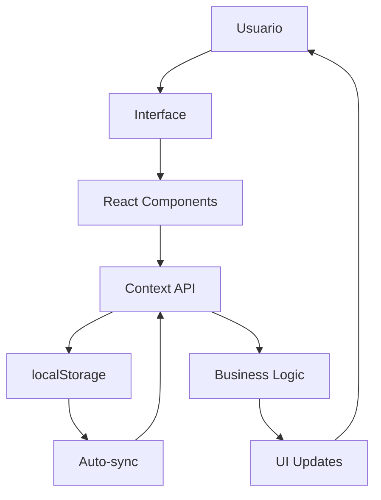
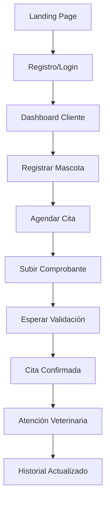
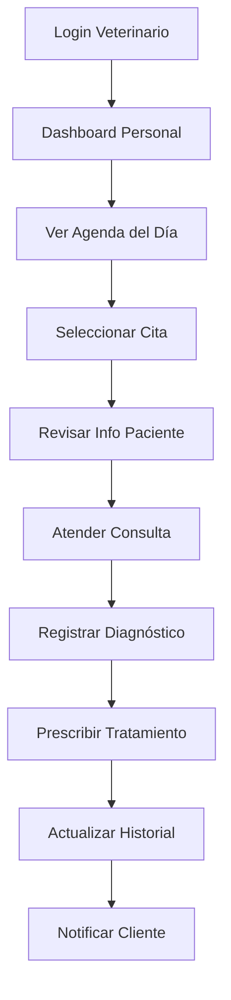
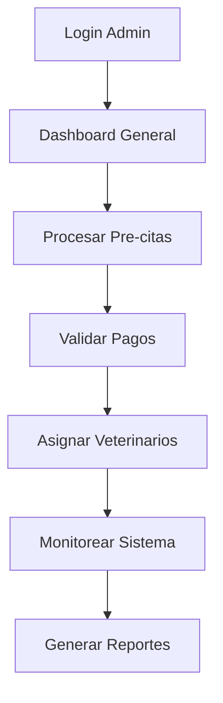
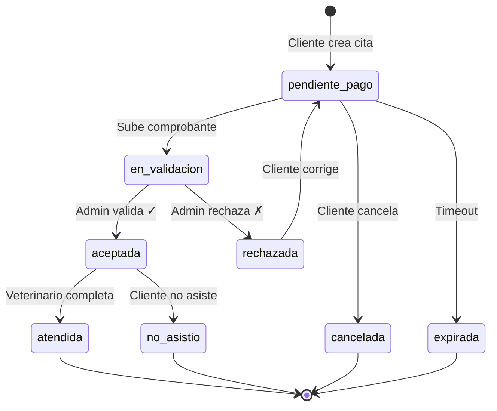
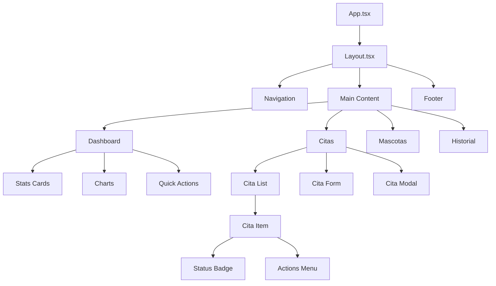

# 🐕 PetLA - Plataforma Veterinaria Digital

<div align="center">
  
  
  **La plataforma veterinaria más completa de Latinoamérica**
  
  [](https://reactjs.org/)
  [](https://www.typescriptlang.org/)
  [](https://tailwindcss.com/)
  [](https://vitejs.dev/)
  [](LICENSE)
</div>

---

## 📋 Tabla de Contenidos

1. [🌟 Descripción del Proyecto](#-descripción-del-proyecto)
2. [🚀 Características Principales](#-características-principales)
3. [🏗️ Arquitectura Técnica](#️-arquitectura-técnica)
4. [👥 Roles y Funcionalidades](#-roles-y-funcionalidades)
5. [🔄 Flujos de Usuario](#-flujos-de-usuario)
6. [🌐 Endpoints de Backend Requeridos](#-endpoints-de-backend-requeridos)
7. [📊 Estructura de Datos](#-estructura-de-datos)
8. [⚙️ Instalación y Configuración](#️-instalación-y-configuración)
9. [🧪 Testing](#-testing)
10. [📱 Responsive Design](#-responsive-design)
11. [🔒 Seguridad](#-seguridad)
12. [🚀 Despliegue](#-despliegue)
13. [📚 Documentación Técnica](#-documentación-técnica)

---

## 🌟 Descripción del Proyecto

**PetLA** es una plataforma web integral diseñada para revolucionar la gestión de clínicas veterinarias, conectando de manera eficiente a propietarios de mascotas, veterinarios y administradores en un ecosistema digital completo.

### 🎯 Misión

Transformar la experiencia veterinaria tradicional mediante tecnología innovadora que:

- **Simplifica** el agendamiento de citas para propietarios de mascotas
- **Optimiza** la gestión de pacientes para veterinarios
- **Automatiza** procesos administrativos para el personal
- **Centraliza** información médica en historiales digitales completos

### 🏥 Casos de Uso Principales

- **Gestión de Citas Médicas**: Sistema completo de agendamiento con validación de pagos
- **Historial Clínico Digital**: Registro completo de consultas veterinarias
- **Dashboard Inteligente**: Métricas y estadísticas por rol de usuario
- **Sistema de Notificaciones**: Comunicación en tiempo real entre usuarios
- **Gestión de Usuarios**: Control completo de clientes, veterinarios y administradores

---

## 🚀 Características Principales

### ✨ Funcionalidades Core

- 🗓️ **Sistema de Citas Avanzado**: Agendamiento con estados automatizados
- 📱 **Responsive Design**: Optimizado para desktop, tablet y móvil
- 🔔 **Notificaciones en Tiempo Real**: Sistema de alertas inteligente
- 📸 **Gestión de Archivos**: Compresión automática de imágenes
- 🔍 **Búsqueda Inteligente**: Filtros avanzados para pacientes y citas
- 📊 **Dashboard por Roles**: Métricas personalizadas para cada usuario
- 💾 **Almacenamiento Local**: Sistema robusto con auto-reparación
- 🛡️ **Control de Acceso**: Rutas protegidas basadas en roles

### 🎨 Diseño y UX

- **Modern UI**: Interfaz basada en Radix UI y TailwindCSS
- **Dark Mode Ready**: Soporte para modo oscuro
- **Accesibilidad**: Cumple estándares WCAG 2.1
- **Performance**: Carga inicial < 2 segundos
- **Animation**: Transiciones fluidas con Framer Motion

---

## 🏗️ Arquitectura Técnica

### 📦 Stack Tecnológico

```typescript
const techStack = {
  // Frontend Framework
  framework: "React 18.3.1",
  language: "TypeScript 5.5.3",
  buildTool: "Vite 6.2.2",
  
  // Routing & State
  routing: "React Router 6.26.2",
  stateManagement: "Context API + localStorage",
  
  // UI & Styling
  styling: "TailwindCSS 3.4.11",
  components: "Radix UI Primitives",
  icons: "Lucide React 0.462.0",
  animations: "Framer Motion 12.6.2",
  
  // Forms & Validation
  forms: "React Hook Form 7.53.0",
  validation: "Zod 3.23.8",
  
  // Development
  testing: "Vitest 3.1.4",
  typeChecking: "TypeScript",
  linting: "ESLint + Prettier"
};
```

### 🏛️ Estructura del Proyecto

```
src/
├── components/              # Componentes reutilizables
│   ├── ui/                 # Primitivos UI (42+ componentes)
│   ├── Layout.tsx          # Layout principal con navegación
│   ├── modals/             # Modales especializados
│   └── shared/             # Componentes compartidos
├── contexts/               # Estado global
│   └── AppContext.tsx      # Context principal de la app
├── hooks/                  # React hooks personalizados
│   ├── useConfirmation.tsx
│   ├── useNotificationToast.tsx
│   └── use-mobile.tsx
├── lib/                    # Lógica de negocio
│   ├── citaUtils.ts        # Utilidades para citas
│   ├── imageUtils.ts       # Compresión de imágenes
│   ├── types.ts            # Definiciones TypeScript
│   └── utils.ts            # Utilidades generales
├── pages/                  # Páginas de la aplicación
│   ├── Dashboard.tsx       # Dashboard principal
│   ├── GestionCitas.tsx    # Gestión de citas (admin)
│   ├── MisPacientes.tsx    # Gestión de pacientes (vet)
│   └── ...                 # 25+ páginas especializadas
└── main.tsx               # Entry point de la aplicación
```

### 🔄 Flujo de Datos



---

## 👥 Roles y Funcionalidades

### 🟦 Cliente (Propietario de Mascotas)

**Funcionalidades principales:**
- ✅ Registro de mascotas con fotos
- ✅ Agendamiento de citas médicas
- ✅ Subida de comprobantes de pago
- ✅ Seguimiento del estado de citas
- ✅ Consulta del historial clínico
- ✅ Recepción de notificaciones

**Rutas disponibles:**
- `/dashboard` - Resumen personal
- `/mascotas` - Gestión de mascotas
- `/mis-citas` - Gestión de citas
- `/nueva-cita` - Agendamiento
- `/historial` - Historial clínico

### 🟩 Veterinario

**Funcionalidades principales:**
- ✅ Agenda médica personalizada
- ✅ Gestión de pacientes asignados
- ✅ Registro de consultas médicas
- ✅ Actualización de historiales clínicos
- ✅ Búsqueda avanzada de pacientes
- ✅ Estadísticas de práctica

**Rutas disponibles:**
- `/dashboard` - Dashboard veterinario
- `/calendario` - Agenda médica
- `/mis-pacientes` - Lista de pacientes
- `/historial-clinico-veterinario` - Historial completo

### 🟥 Administrador

**Funcionalidades principales:**
- ✅ Gestión completa de usuarios
- ✅ Validación de comprobantes de pago
- ✅ Procesamiento de pre-citas
- ✅ Configuración de servicios y precios
- ✅ Gestión de newsletter
- ✅ Estadísticas y reportes

**Rutas disponibles:**
- `/dashboard` - Dashboard administrativo
- `/pre-citas` - Gestión de solicitudes
- `/gestion-citas` - Gestión de citas
- `/validacion-pagos` - Validación de pagos
- `/usuarios` - Gestión de usuarios
- `/veterinarios` - Gestión de veterinarios
- `/gestion-newsletter` - Newsletter

---

## 🔄 Flujos de Usuario

### 🎯 Flujo del Cliente



**Pasos detallados:**
1. **Registro**: Formulario con datos personales + verificación email
2. **Mascotas**: Registro con nombre, especie, raza, fecha nacimiento, foto
3. **Cita**: Selección de mascota, servicio, fecha/hora, confirmación
4. **Pago**: Subida de comprobante (YAPE, PLIN, bancos)
5. **Validación**: Admin verifica pago y confirma cita
6. **Atención**: Veterinario registra consulta médica
7. **Seguimiento**: Cliente accede a historial actualizado

### 🏥 Flujo del Veterinario



**Información registrada:**
- **Signos vitales**: Peso, temperatura, frecuencia cardíaca, presión
- **Examen físico**: Observaciones y hallazgos
- **Diagnóstico**: Principal y secundarios
- **Tratamiento**: Medicamentos con dosis y frecuencia
- **Seguimiento**: Próxima cita y cuidados en casa

### 👨‍💼 Flujo del Administrador



**Responsabilidades clave:**
- **Pre-citas**: Aprobar/rechazar solicitudes del landing
- **Pagos**: Validar comprobantes y confirmar citas
- **Usuarios**: Crear, editar y gestionar cuentas
- **Configuración**: Servicios, precios y parámetros del sistema
- **Reportes**: Estadísticas e informes de gestión

---

## 🌐 Endpoints de Backend Requeridos

### 🔐 Autenticación y Usuarios

```typescript
// Autenticación
POST   /api/auth/login              // Login de usuario
POST   /api/auth/register           // Registro de nuevo usuario
POST   /api/auth/logout             // Cerrar sesión
POST   /api/auth/refresh-token      // Renovar token JWT
POST   /api/auth/forgot-password    // Recuperar contraseña
POST   /api/auth/reset-password     // Resetear contraseña
GET    /api/auth/verify-email/:token // Verificar email

// Gestión de Usuarios
GET    /api/users                   // Lista de usuarios (admin)
GET    /api/users/:id               // Obtener usuario específico
POST   /api/users                   // Crear nuevo usuario (admin)
PUT    /api/users/:id               // Actualizar usuario
DELETE /api/users/:id               // Eliminar usuario (admin)
GET    /api/users/profile           // Perfil del usuario autenticado
PUT    /api/users/profile           // Actualizar perfil propio
PUT    /api/users/change-password   // Cambiar contraseña
POST   /api/users/upload-avatar     // Subir foto de perfil
```

### 🐕 Gestión de Mascotas

```typescript
// CRUD Mascotas
GET    /api/mascotas                // Lista de mascotas del cliente
GET    /api/mascotas/:id            // Obtener mascota específica
POST   /api/mascotas                // Registrar nueva mascota
PUT    /api/mascotas/:id            // Actualizar datos de mascota
DELETE /api/mascotas/:id            // Eliminar mascota
POST   /api/mascotas/:id/upload-photo // Subir foto de mascota

// Búsqueda para veterinarios
GET    /api/mascotas/search         // Búsqueda avanzada de mascotas
GET    /api/mascotas/by-owner/:userId // Mascotas por propietario
GET    /api/mascotas/by-vet/:vetId  // Mascotas asignadas a veterinario
```

### 📅 Sistema de Citas

```typescript
// Gestión de Citas
GET    /api/citas                   // Lista de citas (filtrada por rol)
GET    /api/citas/:id               // Obtener cita específica
POST   /api/citas                   // Crear nueva cita
PUT    /api/citas/:id               // Actualizar cita
DELETE /api/citas/:id               // Eliminar cita (admin)

// Estados de Citas
PUT    /api/citas/:id/estado        // Cambiar estado de cita
PUT    /api/citas/:id/aceptar       // Aceptar cita (admin)
PUT    /api/citas/:id/rechazar      // Rechazar cita (admin)
PUT    /api/citas/:id/atender       // Marcar como atendida (vet)
PUT    /api/citas/:id/cancelar      // Cancelar cita (cliente)

// Gestión de Pagos
POST   /api/citas/:id/comprobante   // Subir comprobante de pago
GET    /api/citas/:id/comprobante   // Obtener comprobante
PUT    /api/citas/:id/validar-pago  // Validar pago (admin)

// Citas por Usuario
GET    /api/citas/cliente/:id       // Citas de un cliente
GET    /api/citas/veterinario/:id   // Citas de un veterinario
GET    /api/citas/calendario/:vetId // Agenda de veterinario
GET    /api/citas/pendientes        // Citas pendientes de validación
```

### 🩺 Historial Clínico

```typescript
// Consultas Médicas
GET    /api/historial/:mascotaId    // Historial de una mascota
GET    /api/historial/consulta/:id  // Consulta específica
POST   /api/historial               // Registrar nueva consulta
PUT    /api/historial/:id           // Actualizar consulta
DELETE /api/historial/:id           // Eliminar consulta (admin)

// Reportes Médicos
GET    /api/historial/reporte/:mascotaId // Reporte médico completo
POST   /api/historial/export        // Exportar historial a PDF
GET    /api/historial/estadisticas/:vetId // Estadísticas veterinario
```

### 📝 Pre-Citas (Landing Page)

```typescript
// Solicitudes Públicas
GET    /api/pre-citas               // Lista de pre-citas (admin)
GET    /api/pre-citas/:id           // Pre-cita específica
POST   /api/pre-citas               // Crear solicitud (público)
PUT    /api/pre-citas/:id/aprobar   // Aprobar pre-cita (admin)
PUT    /api/pre-citas/:id/rechazar  // Rechazar pre-cita (admin)
DELETE /api/pre-citas/:id           // Eliminar pre-cita (admin)
```

### 🔔 Sistema de Notificaciones

```typescript
// Notificaciones
GET    /api/notificaciones          // Notificaciones del usuario
GET    /api/notificaciones/count    // Cantidad no leídas
POST   /api/notificaciones          // Crear notificación (sistema)
PUT    /api/notificaciones/:id/leida // Marcar como leída
PUT    /api/notificaciones/mark-all-read // Marcar todas como leídas
DELETE /api/notificaciones/:id      // Eliminar notificación

// Push Notifications (opcional)
POST   /api/notifications/subscribe // Suscribir a push notifications
POST   /api/notifications/send      // Enviar notificación push
```

### 📧 Newsletter

```typescript
// Gestión Newsletter
GET    /api/newsletter/suscriptores // Lista de suscriptores
POST   /api/newsletter/suscribir    // Suscribir email (público)
DELETE /api/newsletter/unsuscribe/:email // Desuscribir
POST   /api/newsletter/send         // Enviar newsletter (admin)
GET    /api/newsletter/emails       // Historial de emails enviados
POST   /api/newsletter/template     // Crear plantilla
```

### 📊 Estadísticas y Reportes

```typescript
// Dashboard Stats
GET    /api/stats/dashboard/:rol    // Estadísticas por rol
GET    /api/stats/general           // Estadísticas generales (admin)
GET    /api/stats/veterinario/:id   // Estadísticas de veterinario
GET    /api/stats/ingresos          // Reportes de ingresos (admin)

// Reportes Avanzados
GET    /api/reportes/citas          // Reporte de citas por período
GET    /api/reportes/clientes       // Reporte de clientes activos
GET    /api/reportes/veterinarios   // Performance de veterinarios
POST   /api/reportes/custom         // Reportes personalizados
```

### ⚙️ Configuración del Sistema

```typescript
// Configuración
GET    /api/config/servicios        // Lista de servicios veterinarios
PUT    /api/config/servicios        // Actualizar servicios (admin)
GET    /api/config/horarios         // Horarios de atención
PUT    /api/config/horarios         // Actualizar horarios (admin)
GET    /api/config/parametros       // Parámetros del sistema
PUT    /api/config/parametros       // Actualizar parámetros (admin)
```

### 📎 Gestión de Archivos

```typescript
// Upload de Archivos
POST   /api/upload/image            // Subir imagen (comprimida)
POST   /api/upload/document         // Subir documento (PDF)
POST   /api/upload/comprobante      // Subir comprobante de pago
DELETE /api/upload/:fileId          // Eliminar archivo
GET    /api/upload/:fileId          // Descargar archivo

// Límites recomendados:
// - Imágenes: max 5MB, formatos: JPEG, PNG, WebP
// - Documentos: max 10MB, formatos: PDF
// - Comprobantes: max 3MB, formatos: JPEG, PNG, PDF
```

---

## 📊 Estructura de Datos

### 👤 Usuario

```typescript
interface User {
  id: string;                    // UUID único
  nombre: string;               // Nombre completo
  apellidos?: string;           // Apellidos (opcional)
  username?: string;            // Nombre de usuario único
  email: string;                // Email único
  telefono?: string;            // Teléfono de contacto
  direccion?: string;           // Dirección física
  fechaNacimiento?: Date;       // Fecha de nacimiento
  genero?: 'M' | 'F' | 'Otro';  // Género
  rol: UserRole;                // Rol del usuario
  emailVerificado: boolean;     // Estado de verificación
  foto?: string;                // URL de foto de perfil
  fechaCreacion: Date;          // Timestamp de creación
  fechaActualizacion: Date;     // Timestamp de última actualización
  activo: boolean;              // Estado activo/inactivo
}

type UserRole = 'cliente' | 'veterinario' | 'admin';
```

### 🐕 Mascota

```typescript
interface Mascota {
  id: string;                   // UUID único
  nombre: string;               // Nombre de la mascota
  especie: string;              // Perro, Gato, etc.
  raza: string;                 // Raza específica
  sexo?: 'Macho' | 'Hembra';    // Sexo de la mascota
  fechaNacimiento: Date;        // Fecha de nacimiento
  peso?: number;                // Peso en kg
  microchip?: string;           // Número de microchip
  estado: string;               // Estado general de salud
  clienteId: string;            // FK: ID del propietario
  veterinarioId?: string;       // FK: Veterinario asignado
  foto?: string;                // URL de foto
  proximaCita?: Date;           // Próxima cita programada
  ultimaVacuna?: Date;          // Fecha de última vacuna
  observaciones?: string;       // Observaciones generales
  fechaCreacion: Date;          // Timestamp de creación
  fechaActualizacion: Date;     // Timestamp de actualización
}
```

### 📅 Cita

```typescript
interface Cita {
  id: string;                   // UUID único
  mascotaId: string;            // FK: ID de la mascota
  clienteId: string;            // FK: ID del cliente
  veterinarioId?: string;       // FK: ID del veterinario asignado
  fecha: Date;                  // Fecha y hora de la cita
  estado: EstadoCita;           // Estado actual
  tipoConsulta: TipoConsulta;   // Tipo de consulta
  motivo: string;               // Motivo de la consulta
  ubicacion: string;            // Ubicación de la consulta
  precio: number;               // Precio del servicio
  comprobantePago?: string;     // URL del comprobante
  notas?: string;               // Notas adicionales
  notasAdmin?: string;          // Notas del administrador
  fechaCreacion: Date;          // Timestamp de creación
  fechaActualizacion: Date;     // Timestamp de actualización
}

type EstadoCita = 
  | 'pendiente_pago'           // Esperando comprobante de pago
  | 'en_validacion'            // Comprobante subido, pendiente validación
  | 'aceptada'                 // Pago validado, cita confirmada
  | 'atendida'                 // Consulta completada
  | 'cancelada'                // Cancelada por el cliente
  | 'rechazada'                // Pago rechazado
  | 'no_asistio'               // Cliente no asistió
  | 'expirada';                // Tiempo límite excedido

type TipoConsulta = 
  | 'consulta_general'         // Consulta médica general (S/. 80)
  | 'vacunacion'               // Vacunación (S/. 65)
  | 'emergencia'               // Atención de emergencia (S/. 150)
  | 'grooming'                 // Baño y peluquería (S/. 45)
  | 'cirugia'                  // Procedimiento quirúrgico (S/. 250)
  | 'diagnostico';             // Diagnóstico especializado (S/. 120)
```

### 🩺 Historial Clínico

```typescript
interface HistorialClinico {
  id: string;                   // UUID único
  citaId: string;               // FK: ID de la cita
  mascotaId: string;            // FK: ID de la mascota
  veterinarioId: string;        // FK: ID del veterinario
  fecha: Date;                  // Fecha de la consulta
  
  // Signos Vitales
  peso?: number;                // Peso en kg
  temperatura?: number;         // Temperatura en °C
  frecuenciaCardiaca?: number;  // Pulsaciones por minuto
  presionArterial?: string;     // Presión arterial
  
  // Consulta Médica
  motivoConsulta: string;       // Motivo de la consulta
  sintomasObservados?: string;  // Síntomas observados
  examenFisico?: string;        // Hallazgos del examen físico
  
  // Diagnóstico y Tratamiento
  diagnostico: string;          // Diagnóstico principal
  diagnosticosSecundarios?: string[]; // Diagnósticos secundarios
  tratamiento: string;          // Plan de tratamiento
  medicamentos?: Medicamento[]; // Medicamentos recetados
  procedimientos?: string[];    // Procedimientos realizados
  
  // Seguimiento
  proximaCita?: Date;           // Fecha de próxima cita
  instrucciones?: string;       // Instrucciones para el propietario
  observaciones?: string;       // Observaciones adicionales
  
  // Archivos adjuntos
  archivos?: ArchivoMedico[];   // Radiografías, exámenes, etc.
  
  fechaCreacion: Date;          // Timestamp de creación
  fechaActualizacion: Date;     // Timestamp de actualización
}

interface Medicamento {
  nombre: string;               // Nombre del medicamento
  dosis: string;                // Dosis prescrita
  frecuencia: string;           // Frecuencia de administración
  duracion: string;             // Duración del tratamiento
  instrucciones?: string;       // Instrucciones especiales
}

interface ArchivoMedico {
  id: string;                   // UUID único
  nombre: string;               // Nombre del archivo
  tipo: string;                 // Tipo de archivo (radiografia, examen, etc.)
  url: string;                  // URL del archivo
  fechaSubida: Date;            // Fecha de subida
}
```

### 🔔 Notificación

```typescript
interface Notificacion {
  id: string;                   // UUID único
  usuarioId: string;            // FK: ID del usuario destinatario
  tipo: TipoNotificacion;       // Tipo de notificación
  titulo: string;               // Título de la notificación
  mensaje: string;              // Contenido del mensaje
  leida: boolean;               // Estado de lectura
  prioridad: 'alta' | 'media' | 'baja'; // Prioridad
  relacionadoTipo?: string;     // Tipo de entidad relacionada
  relacionadoId?: string;       // ID de entidad relacionada
  fechaCreacion: Date;          // Timestamp de creación
  fechaExpiracion?: Date;       // Fecha de expiración (opcional)
}

type TipoNotificacion = 
  | 'bienvenida_cliente'        // Nuevo usuario registrado
  | 'cita_creada'               // Nueva cita creada
  | 'cita_aceptada'             // Cita confirmada
  | 'cita_rechazada'            // Cita rechazada
  | 'cita_recordatorio'         // Recordatorio de cita
  | 'pago_validado'             // Pago confirmado
  | 'consulta_registrada'       // Consulta médica registrada
  | 'sistema'                   // Notificación del sistema
  | 'newsletter';               // Newsletter enviado
```

### 📝 Pre-Cita

```typescript
interface PreCita {
  id: string;                   // UUID único
  nombreCliente: string;        // Nombre del solicitante
  telefono: string;             // Teléfono de contacto
  email: string;                // Email de contacto
  nombreMascota: string;        // Nombre de la mascota
  tipoMascota: string;          // Tipo de mascota
  motivoConsulta: string;       // Motivo de la consulta
  fechaSolicitada: Date;        // Fecha preferida
  estado: EstadoPreCita;        // Estado de la solicitud
  observaciones?: string;       // Observaciones adicionales
  notasAdmin?: string;          // Notas del administrador
  fechaCreacion: Date;          // Timestamp de creación
  fechaProcessado?: Date;       // Fecha de procesamiento
}

type EstadoPreCita = 'pendiente' | 'aceptada' | 'rechazada';
```

### 📧 Newsletter

```typescript
interface SuscriptorNewsletter {
  id: string;                   // UUID único
  email: string;                // Email del suscriptor
  fechaSuscripcion: Date;       // Fecha de suscripción
  activo: boolean;              // Estado activo/inactivo
  origen: string;               // Origen de la suscripción
  fechaUltimaComunicacion?: Date; // Última comunicación
}

interface NewsletterEmail {
  id: string;                   // UUID único
  asunto: string;               // Asunto del email
  contenido: string;            // Contenido HTML del email
  destinatarios: string[];      // Lista de emails destinatarios
  estado: EstadoNewsletter;     // Estado del envío
  fechaEnvio?: Date;            // Fecha de envío
  fechaProgramada?: Date;       // Fecha programada (si aplica)
  plantilla?: string;           // Plantilla utilizada
  estadisticas?: EstadisticasEmail; // Estadísticas de envío
  fechaCreacion: Date;          // Timestamp de creación
}

type EstadoNewsletter = 'borrador' | 'programado' | 'enviando' | 'enviado' | 'error';

interface EstadisticasEmail {
  totalEnviados: number;        // Total de emails enviados
  entregados: number;           // Emails entregados
  abiertos: number;             // Emails abiertos
  clicks: number;               // Clicks realizados
  rechazados: number;           // Emails rechazados
  desuscripciones: number;      // Desuscripciones generadas
}
```

---

## ⚙️ Instalaci��n y Configuración

### 📋 Prerrequisitos

- **Node.js**: v18.0.0 o superior
- **npm**: v8.0.0 o superior (o yarn/pnpm)
- **Git**: Para clonar el repositorio

### 🚀 Instalación

```bash
# Clonar el repositorio
git clone https://github.com/tu-usuario/petla.git
cd petla

# Instalar dependencias
npm install

# Configurar variables de entorno
cp .env.example .env.local

# Iniciar servidor de desarrollo
npm run dev
```

### 🔧 Variables de Entorno

```bash
# .env.local
VITE_API_URL=http://localhost:3001/api
VITE_APP_NAME=PetLA
VITE_APP_VERSION=1.0.0
VITE_UPLOAD_MAX_SIZE=5242880  # 5MB en bytes
VITE_ENABLE_NOTIFICATIONS=true
VITE_ENABLE_DEBUG=false
```

### 📦 Scripts Disponibles

```bash
# Desarrollo
npm run dev              # Iniciar servidor de desarrollo
npm run dev:host         # Servidor accesible en red local

# Construcción
npm run build            # Construir para producción
npm run preview          # Previsualizar build de producción

# Testing
npm run test             # Ejecutar tests unitarios
npm run test:ui          # Tests con interfaz gráfica
npm run test:coverage    # Tests con coverage

# Calidad de Código
npm run typecheck        # Verificar tipos TypeScript
npm run lint             # Linter ESLint
npm run format           # Formatear código con Prettier
npm run format:check     # Verificar formato
```

---

## 🧪 Testing

### 🔬 Estrategia de Testing

El proyecto implementa testing a múltiples niveles:

- **Unit Tests**: Componentes y funciones aisladas
- **Integration Tests**: Flujos de usuario completos
- **E2E Tests**: Pruebas end-to-end con Playwright (recomendado)

### 🧩 Utilidades de Testing

```typescript
// src/lib/utils.spec.ts
import { describe, it, expect } from 'vitest';
import { cn } from './utils';

describe('cn utility function', () => {
  it('combines class names correctly', () => {
    expect(cn('btn', 'btn-primary')).toBe('btn btn-primary');
  });

  it('handles conditional classes', () => {
    expect(cn('btn', { 'btn-primary': true, 'btn-secondary': false }))
      .toBe('btn btn-primary');
  });
});
```

### 📊 Coverage Goals

- **Funciones críticas**: 100% coverage
- **Componentes UI**: 80% coverage
- **Utils y helpers**: 95% coverage
- **Global**: 85% coverage mínimo

---

## 📱 Responsive Design

### 📐 Breakpoints

```css
/* TailwindCSS Breakpoints */
sm: 640px     /* Móviles grandes / tablets pequeños */
md: 768px     /* Tablets */
lg: 1024px    /* Laptops */
xl: 1280px    /* Desktops */
2xl: 1536px   /* Desktops grandes */
```

### 📱 Características Responsive

- **Navegación adaptiva**: Sidebar en desktop, menú hamburguesa en móvil
- **Tablas responsive**: Scroll horizontal en pantallas pequeñas
- **Modales adaptivos**: Fullscreen en móvil, centrados en desktop
- **Formularios optimizados**: Inputs más grandes en touch devices
- **Imágenes responsive**: Optimización automática según viewport

### 🎨 Consideraciones de UX Móvil

- **Touch targets**: Mínimo 44px de altura para elementos clickeables
- **Gestos**: Soporte para swipe en carruseles y modales
- **Performance**: Lazy loading de imágenes y componentes pesados
- **Accesibilidad**: Contraste adecuado y navegación por teclado

---

## 🔒 Seguridad

### 🛡️ Autenticación y Autorización

```typescript
// Estrategia de autenticación recomendada
interface AuthStrategy {
  // JWT con refresh tokens
  accessToken: {
    expiry: '15 minutes',
    storage: 'memory' // No localStorage por seguridad
  },
  
  refreshToken: {
    expiry: '7 days',
    storage: 'httpOnly cookie',
    rotation: true // Rotar en cada uso
  },
  
  // Protección CSRF
  csrfToken: {
    validation: 'per-request',
    header: 'X-CSRF-Token'
  }
}
```

### 🔐 Validaciones Frontend

- **Input sanitization**: Escape de caracteres especiales
- **File upload validation**: Tipo, tama��o y contenido de archivos
- **XSS Prevention**: Sanitización de contenido HTML
- **CSRF Protection**: Tokens de validación en formularios

### 🚫 Políticas de Seguridad

```typescript
// Content Security Policy recomendada
const CSP = {
  defaultSrc: ["'self'"],
  styleSrc: ["'self'", "'unsafe-inline'", "cdn.tailwindcss.com"],
  scriptSrc: ["'self'"],
  imgSrc: ["'self'", "data:", "blob:", "*.amazonaws.com"],
  connectSrc: ["'self'", process.env.VITE_API_URL],
  fontSrc: ["'self'", "fonts.googleapis.com", "fonts.gstatic.com"]
};
```

### 🔍 Auditoría y Logging

- **Acciones críticas**: Login, cambios de estado, eliminaciones
- **Errores**: Captura y reporte automático con Sentry (recomendado)
- **Performance**: Métricas con Web Vitals
- **Usage analytics**: Con respeto a la privacidad del usuario

---

## 🚀 Despliegue

### ☁️ Opciones de Hosting Recomendadas

1. **Vercel** (Recomendado)
   - Deploy automático desde Git
   - Optimizaciones automáticas
   - CDN global incluido
   - Serverless functions para APIs simples

2. **Netlify**
   - Build automático
   - Form handling nativo
   - Split testing A/B
   - Edge functions

3. **AWS S3 + CloudFront**
   - Control total sobre infraestructura
   - Optimización de costos
   - Integración con otros servicios AWS

### 🔧 Configuración de Despliegue

```yaml
# vercel.json
{
  "buildCommand": "npm run build",
  "outputDirectory": "dist",
  "framework": "vite",
  "routes": [
    { "src": "/api/(.*)", "dest": "/api/$1" },
    { "src": "/(.*)", "dest": "/index.html" }
  ],
  "env": {
    "VITE_API_URL": "@api-url",
    "VITE_APP_NAME": "PetLA"
  }
}
```

### 🚦 CI/CD Pipeline

```yaml
# .github/workflows/deploy.yml
name: Deploy to Production
on:
  push:
    branches: [main]

jobs:
  deploy:
    runs-on: ubuntu-latest
    steps:
      - uses: actions/checkout@v3
      - uses: actions/setup-node@v3
        with:
          node-version: '18'
          cache: 'npm'
      
      - run: npm ci
      - run: npm run typecheck
      - run: npm run test
      - run: npm run build
      
      - uses: vercel/action@v1
        with:
          vercel-token: ${{ secrets.VERCEL_TOKEN }}
          vercel-org-id: ${{ secrets.ORG_ID }}
          vercel-project-id: ${{ secrets.PROJECT_ID }}
```

### 📊 Monitoring en Producción

- **Error tracking**: Sentry para captura de errores
- **Performance**: Web Vitals y métricas de usuario real
- **Uptime**: Monitoreo de disponibilidad con Pingdom/UptimeRobot
- **Analytics**: Google Analytics o Plausible (privacy-friendly)

---

## 📚 Documentación Técnica

### 📖 Documentación Adicional

- [**FLUJOS_SISTEMA.md**](FLUJOS_SISTEMA.md) - Documentación detallada de flujos
- [**CLAUDE.md**](CLAUDE.md) - Guía técnica del framework
- [**Components Documentation**](src/components/README.md) - Documentación de componentes
- [**API Documentation**](docs/api.md) - Especificación completa de APIs

### 🔄 Flujos de Estado Avanzados



### 🏗️ Arquitectura de Componentes



### 🔍 Performance Optimization

- **Bundle size**: < 500KB inicial, < 2MB total
- **Code splitting**: Por rutas y componentes pesados
- **Image optimization**: Compresión automática a WebP
- **Caching**: Service Worker para recursos estáticos
- **Lazy loading**: Componentes y rutas bajo demanda

### 🧪 Testing Strategy

```typescript
// Estructura de tests recomendada
src/
├── __tests__/              # Tests globales
├── components/
│   ├── __tests__/          # Tests de componentes
│   └── Component.test.tsx  # Tests individuales
├── hooks/
│   └── __tests__/          # Tests de hooks
├── lib/
│   └── __tests__/          # Tests de utilidades
└── pages/
    └── __tests__/          # Tests de integración
```

---

## 🤝 Contribución

### 📝 Guías de Desarrollo

1. **Commits**: Seguir [Conventional Commits](https://conventionalcommits.org/)
2. **Branches**: Feature branches desde `develop`
3. **PRs**: Templates obligatorios con checklist
4. **Code Review**: Mínimo 2 aprobaciones para `main`

### 🎯 Roadmap

- [ ] **v1.1**: Integración con APIs de terceros (WhatsApp, SMS)
- [ ] **v1.2**: App móvil React Native
- [ ] **v1.3**: Telemedicina y videollamadas
- [ ] **v1.4**: IA para diagnósticos asistidos
- [ ] **v1.5**: Integración con laboratorios

---

## 📞 Soporte y Contacto

- **Email**: dev@petla.com
- **Documentation**: [docs.petla.com](https://docs.petla.com)
- **Issues**: [GitHub Issues](https://github.com/tu-usuario/petla/issues)
- **Discussions**: [GitHub Discussions](https://github.com/tu-usuario/petla/discussions)

---

## 📄 Licencia

Este proyecto está licenciado bajo la [Licencia MIT](LICENSE) - consulta el archivo LICENSE para más detalles.

---

<div align="center">
  <p><strong>Desarrollado con ❤️ para el bienestar animal</strong></p>
  <p>© 2024 PetLA. Todos los derechos reservados.</p>
</div>
